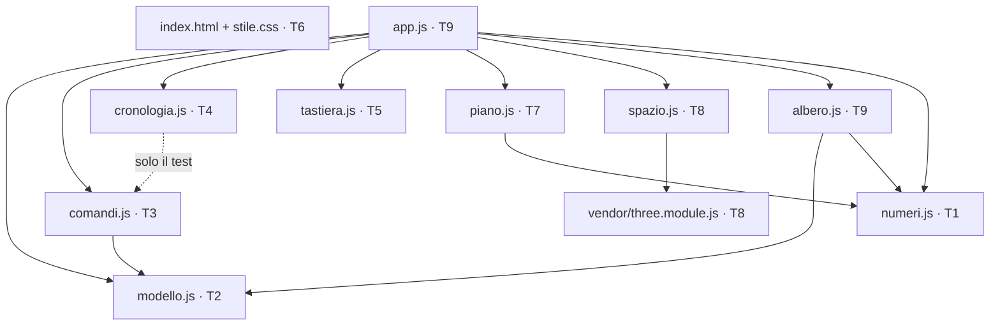

# NOVA T5 — giornata 10: spazio di modellazione

> **For agentic workers:** REQUIRED SUB-SKILL: Use superpowers:subagent-driven-development (recommended) or superpowers:executing-plans to implement this plan task-by-task. Steps use checkbox (`- [ ]`) syntax for tracking.

**Goal:** l'ingegnere disegna il telaio 2×1 da zero, con la sola tastiera, in meno di due minuti, vedendolo insieme nel piano SVG e nello spazio three.js.

**Architecture:** modello immutabile in memoria, un riduttore puro per comando, uno snapshot per comando in una cronologia lineare; le viste (piano SVG, spazio three.js, albero, barra dei tasti) **derivano** dallo stato e non ne tengono di proprio; la selezione è un solo identificatore, in `app.js`, letto da tutte le viste. Moduli ES nativi serviti da `static/`, nessun bundler, nessuna rete a tempo d'uso.

**Tech Stack:** JavaScript a mano (moduli ES), SVG, three.js 0.185 vendorizzato in `static/vendor/`, `node --test` per i moduli puri, `pytest` come comando unico, FastAPI (già in piedi) che serve `static/`.

**Spec:** `docs/superpowers/specs/2026-09-05-nova-v1-design.md` — story 1–7, 10–14; §«Interfaccia»; §«Testing Decisions» cucitura 3. Bozza delle sei giornate: `docs/superpowers/plans/2026-09-06-t5-interfaccia-bozza.md`.

## Global Constraints

- **Lingua italiana** in interfaccia, commenti e messaggi di commit. Gli identificatori tecnici restano invariati (`CONTEXT.md`, «Da preservare alla lettera»).
- **Notazione numerica italiana**: la virgola separa i decimali, sempre. Il punto separa le migliaia o le migliaia non si separano.
- **Unità `mm-N-MPa-t-s`**, dichiarate in un punto solo e stampate su ogni numero.
- **Palette «colonna tensegrale»**: fondo `#dcdad5`, inchiostro `#141414`, un solo rosso `#b8321e`, mono tabulare per i numeri. Il rosso vuol dire una cosa sola: attenzione (selezione, fallito, stantio). **Mai «cream palette»** — `.impeccable/config.json` la esclude già per `static/index.html`.
- **Nessuna rete a tempo d'uso**: three.js sta in `static/vendor/`, nessun CDN, nessun `import` remoto.
- **Nessun bundler, nessun `package.json`**: moduli ES nativi, `<script type="module">`.
- **WCAG AA**; nessuna informazione sul solo colore (doppio canale: colore + forma o testo).
- **Zero sovrapposizioni e zero testo tagliato**, verificato in browser a 1280 e a 1920 px. La skill `impeccable` è obbligatoria per ogni task che tocca `static/`.
- **Comando dei test**, dalla radice del worktree:
  `PATH=/Users/mario/.local/bin:$PATH .venv/bin/python -P -m pytest tests -p no:cacheprovider`
- **Backend invariato in questa giornata.** Nessun file sotto `nova/` cambia; l'unica rotta usata è `GET /` che serve `static/index.html` (`nova/server.py:287`).
- **Modello in memoria, mai su disco.** Apri/salva sono giornata 11. Un'asta può quindi avere `sezione: null` finché il catalogo delle sezioni non esiste: è uno stato intermedio dichiarato, non un file valido.

## Struttura dei file

| file | responsabilità | puro |
|---|---|---|
| `static/numeri.js` | lettura e stampa dei numeri in notazione italiana | sì |
| `static/modello.js` | forma dello stato allineata a `nova/modello.py`; letture; allocazione degli identificatori | sì |
| `static/comandi.js` | un riduttore per comando: `(modello, argomenti) → modello nuovo`; `ErroreComando` | sì |
| `static/cronologia.js` | pila di snapshot, uno per comando; avanti e indietro | sì |
| `static/tastiera.js` | mappa tasto → comando; la barra in basso si genera da qui | sì |
| `static/stile.css` | token della palette, griglia a tre colonne, tipografia | — |
| `static/index.html` | guscio: albero, piano, spazio, pannello, barra | — |
| `static/piano.js` | render SVG del piano attivo, hit-testing, ghost dell'estrusione | no |
| `static/spazio.js` | vista three.js in sola lettura, stessa selezione | no |
| `static/albero.js` | albero delle entità a sinistra | no |
| `static/app.js` | cucitura: stato → viste, eventi → comandi, selezione unica | no |
| `static/vendor/three.module.js` | three.js 0.185, fissato, con impronta annotata | — |
| `static/vendor/three.LICENSE` | licenza MIT di three.js, verbatim | — |
| `static/test/*.test.js` | test `node --test` sui moduli puri | — |
| `tests/test_js.py` | fa girare `node --test` dentro `pytest` | — |

## Annotazione di dispatch

Scritta il 06/09/2026 dall'`architect` sul worktree `feat/interfaccia`, prima del dispatch.
Non tocca la logica dei task: aggiunge chi li esegue, in che ordine, con quale skill-gate,
e dove un agente fresco può sbagliare senza accorgersene.

### Chi esegue

Tutti e nove i task cadono dentro `static/`: assegnati a **`frontend-engineer`**, senza
eccezioni. Il solo file fuori da `static/` è `tests/test_js.py` (Task 1, venti righe di
cucitura `subprocess`): staccarlo su `backend-engineer` costerebbe un dispatch in più per
un file senza logica di dominio, che serve a chi scrive i moduli JS e a nessun altro.
Nessun task del piano resta scoperto dal roster.

### Il grafo vero degli import

Preso dal codice dei task, non dai blocchi `Interfaces`: i due divergono in due punti
(vedi «Scostamenti»).



`cronologia.js` non importa niente: è il suo **test** a tirare dentro `comandi.js`, ed è
quello a legare T4 dopo T3. `piano.js` importa il solo `numeri.js`. Il guscio non importa
nessun modulo: carica `app.js` e basta.

### Onde

| onda | task | in parallelo | perché |
|---|---|---|---|
| 0 | 1 | no, da solo | crea `tests/test_js.py`, la cucitura che ogni verifica dopo richiama |
| 1 | 2 → 3 → 4 · 5 · 6 | tre corsie | 2→3→4 è una catena forzata (import e test); 5 e 6 non toccano nessun file delle altre |
| 2 | 7 · 8 | due corsie | file disgiunti; entrambe **leggono** il DOM del Task 6, nessuna lo scrive |
| 3 | 9 | no, da solo | cuce tutto quel che le onde prima hanno prodotto |

La corsia 2→3→4 va a **un solo agente** per tutta la catena: tre dispatch separati si
passerebbero lo stato via file e pagherebbero due riletture di `modello.js` per niente.

### Tre regole per le onde parallele (stesso worktree, stessi comandi)

1. **La verifica JS si stringe al proprio file.** `pytest tests/test_js.py` espande
   `static/test/*.test.js`: in onda parallela raccoglie anche il test che l'altra corsia
   sta scrivendo a metà, e fallisce per colpa d'altri. In onda 1 e 2 ogni corsia verifica
   con `node --test static/test/<il proprio>.test.js`; `pytest tests` intero gira al
   confine dell'onda, quando le corsie hanno chiuso.
2. **Una porta per corsia.** L'onda 2 farebbe partire due volte `python -m nova --porta
   8766` e la seconda morirebbe su porta occupata. Task 7 usa **8766**, Task 8 usa **8767**.
3. **Commit con pathspec esplicito.** In onda parallela lo staging condiviso si porta
   dentro anche quel che l'altra corsia ha appena messo in indice. Forma da usare:
   `git commit <percorsi> -m "..."`, che ignora il resto dell'indice.

### Skill-gate

`true` su tutti e nove. `impeccable` è **nominata** solo dove il file toccato è di
interfaccia — **Task 6, 7, 8, 9** (`index.html`, `stile.css`, `piano.js`, `spazio.js`,
`albero.js`, `app.js`). Sui task 1–5 il gate resta vincolante ma la skill la sceglie
l'agente: sono moduli puri, con il test scritto prima, e non c'è superficie da guardare.
**Mai «cream palette»**, in nessuno dei quattro.

### Scostamenti trovati durante l'annotazione

- **`.impeccable/config.json` non esiste in questo worktree.** Il vincolo globale dice che
  «esclude già la cream palette per `static/index.html`»: la cartella `.impeccable/` è
  **non tracciata** nel checkout principale, quindi qui non arriva. Il divieto regge lo
  stesso, perché `PRODUCT.md:186` porta la palette «colonna tensegrale» e `impeccable`
  legge `PRODUCT.md` — ma va detto all'agente, che altrimenti si fida di una
  configurazione assente.
- **Task 6 dichiara `Consumes: static/tastiera.js`**: `index.html` non lo nomina. La barra
  la riempie `app.js` al Task 9. La dipendenza dichiarata non esiste e non vincola l'ordine.
- **Task 7 dichiara `Consumes: asteDelNodo, nodo da static/modello.js`**: `piano.js`
  importa il solo `numeri.js` e rifà `m.nodi.find((n) => n.id === …)` tre volte a mano. O
  importa `nodo` e cancella le tre righe, o corregge il blocco. Il grafo sopra legge il
  codice.
- **`modelloVuoto()` non porta `impostazioni_analisi`**, che `nova/modello.py:365` invece
  dichiara. Regge, perché il campo ha un default e `extra="forbid"` rifiuta solo i campi in
  più — ma «la stessa forma di `nova/modello.py:354`» è una frase più larga del vero.

---

### Task 1: cucitura dei test JS e notazione italiana

**Files:**
- Create: `static/numeri.js`
- Create: `static/test/numeri.test.js`
- Create: `tests/test_js.py`

**Interfaces:**
- Consumes: niente.
- Produces: `leggiNumero(testo) → number | null`, `stampaNumero(valore, {decimali = 1, migliaia = false}) → string`. La cucitura `tests/test_js.py` che tutti i task successivi riusano senza modificarla.

**Dispatch:** `frontend-engineer` · onda **0**, da solo · skill-gate **true** (skill a scelta dell'agente: modulo puro, nessuna superficie da guardare).

**Rischi (agente fresco):**
- `stampaNumero(-0.4, { decimali: 0 })` dà `"-0"`: `toFixed` tiene il segno di uno zero. Nessun test lo copre. Segnale: una coordinata a −0,4 mm si stampa «−0 mm».
- `leggiNumero("1.234")` torna **1,234**, non 1234 — è la regola dichiarata nel commento, non un difetto. Nessun test la fissa: senza un assert il primo che legge il file la «corregge». Aggiungi la riga, non riscrivere la regola.
- La cucitura `tests/test_js.py` la riusano tutti i task dopo: **non modificarla** più avanti e non allargare il glob oltre `static/test/*.test.js`.

**Ingressi degeneri:**
- stringa vuota o soli spazi → `null`, mai `NaN`
- `"2.5"` (separatore inglese) → `2.5`, non `25`
- `"1.234,5"` (migliaia italiane) → `1234.5`
- `"abc"`, `"1,2,3"`, `"--3"` → `null`
- `stampaNumero(NaN)` o `stampaNumero(Infinity)` → `"—"`, mai `"NaN"` a schermo
- `node` assente sulla macchina → il test `pytest` è **saltato con motivo**, non fallito

- [ ] **Step 1: Scrivi il test JS che fallisce**

Crea `static/test/numeri.test.js`:

```js
import { test } from "node:test";
import assert from "node:assert/strict";
import { leggiNumero, stampaNumero } from "../numeri.js";

test("la virgola separa i decimali", () => {
  assert.equal(leggiNumero("2,5"), 2.5);
});

test("il punto decimale inglese si legge lo stesso, non come migliaia", () => {
  assert.equal(leggiNumero("2.5"), 2.5);
});

test("il punto separa le migliaia quando la virgola c'è già", () => {
  assert.equal(leggiNumero("1.234,5"), 1234.5);
});

test("gli spazi attorno non contano", () => {
  assert.equal(leggiNumero("  1200 "), 1200);
});

test("quel che non è un numero è null, mai NaN", () => {
  for (const t of ["", "   ", "abc", "1,2,3", "--3", "1,2.3"]) {
    assert.equal(leggiNumero(t), null, `«${t}» doveva essere null`);
  }
});

test("stampa con la virgola decimale", () => {
  assert.equal(stampaNumero(2.5), "2,5");
});

test("stampa le migliaia col punto solo se richiesto", () => {
  assert.equal(stampaNumero(1234.5, { migliaia: true }), "1.234,5");
  assert.equal(stampaNumero(1234.5), "1234,5");
});

test("le migliaia senza decimali non lasciano una coda vuota", () => {
  assert.equal(stampaNumero(5000, { decimali: 0, migliaia: true }), "5.000");
  assert.equal(stampaNumero(-5000, { decimali: 0, migliaia: true }), "-5.000");
  assert.equal(stampaNumero(0, { decimali: 0, migliaia: true }), "0");
});

test("un numero che non è finito si stampa come trattino, mai NaN", () => {
  assert.equal(stampaNumero(NaN), "—");
  assert.equal(stampaNumero(Infinity), "—");
});

test("uno zero non porta mai il segno meno", () => {
  assert.equal(stampaNumero(-0.4, { decimali: 0 }), "0");
  assert.equal(stampaNumero(-0, { decimali: 1 }), "0,0");
  assert.equal(stampaNumero(-0.6, { decimali: 0 }), "-1", "il meno resta quando il numero non è zero");
});
```

- [ ] **Step 2: Scrivi la cucitura pytest che fallisce**

Crea `tests/test_js.py`:

```python
"""I moduli puri dell'interfaccia, provati con `node --test` da dentro pytest.

Cucitura 3 della spec («Testing Decisions»): le funzioni vere dei moduli JS, non il DOM.
Il DOM si guarda in browser, non si finge qui. Prior art: `tests/test_app_js.py` di MeshRec.
"""
import shutil
import subprocess
from pathlib import Path

import pytest

RADICE = Path(__file__).resolve().parent.parent

# Il modello glob, non la cartella: misurato il 06/09/2026 su node v26.7.0, `node --test
# static/test` prova a *importare* quel percorso come modulo e muore con MODULE_NOT_FOUND.
# Il glob lo espande node, non la shell: `subprocess.run` senza `shell=True` glielo passa
# alla lettera, ed è quel che serve.
MODELLO_TEST_JS = "static/test/*.test.js"


def test_moduli_puri_dell_interfaccia():
    node = shutil.which("node")
    if node is None:
        pytest.skip("node non è installato: i moduli puri dell'interfaccia non si provano qui")
    esito = subprocess.run([node, "--test", MODELLO_TEST_JS], capture_output=True, text=True, cwd=RADICE)
    assert esito.returncode == 0, esito.stdout + esito.stderr
```

- [ ] **Step 3: Fai girare i test e verifica che falliscano**

Run: `PATH=/Users/mario/.local/bin:$PATH .venv/bin/python -P -m pytest tests/test_js.py -v -p no:cacheprovider`
Expected: FAIL — `node` non trova `../numeri.js`, `Cannot find module`.

- [ ] **Step 4: Scrivi `static/numeri.js`**

```js
// Notazione numerica italiana (AGENTS.md, «Convenzioni»): la virgola separa i decimali,
// sempre; il punto separa le migliaia o le migliaia non si separano. Un'unica porta di
// ingresso e una sola d'uscita, così nessun campo la reinventa a modo suo.

// La regola, dichiarata una volta perché «1.234» è ambiguo e indovinare è peggio che
// scegliere: **il punto è decimale finché non compare una virgola**. Con la virgola in
// campo, il punto diventa separatore di migliaia. Così «2.5» è due e mezzo e «1.234,5» è
// milleduecentotrentaquattro e mezzo, e nessuno dei due dipende dal contesto.
const INGLESE = /^-?\d+(\.\d+)?$/;                  // 2.5 · 1200
const MIGLIAIA = /^-?\d{1,3}(\.\d{3})+(,\d+)?$/;    // 1.234,5 · 1.234.567
const VIRGOLA = /^-?\d+(,\d+)?$/;                   // 2,5 · 1200

/** Legge un numero scritto da una persona. Torna `null` — mai `NaN` — se non è un numero. */
export function leggiNumero(testo) {
  if (typeof testo !== "string") return null;
  const t = testo.trim();
  if (t === "") return null;
  if (t.includes(",")) {
    if (!MIGLIAIA.test(t) && !VIRGOLA.test(t)) return null;
    return Number(t.replaceAll(".", "").replace(",", "."));
  }
  if (!INGLESE.test(t)) return null;
  return Number(t);
}

/** Stampa un numero per una persona. Quel che non è finito esce come trattino, non come «NaN». */
export function stampaNumero(valore, { decimali = 1, migliaia = false } = {}) {
  if (!Number.isFinite(valore)) return "—";
  // `(-0,4).toFixed(0)` è «-0»: un meno che non dice niente su una quota che è zero.
  const arrotondato = Number(valore.toFixed(decimali)) === 0 ? 0 : valore;
  const fisso = arrotondato.toFixed(decimali).replace(".", ",");
  if (!migliaia) return fisso;
  const [intera, frazione] = fisso.split(",");
  const segno = intera.startsWith("-") ? "-" : "";
  const cifre = segno ? intera.slice(1) : intera;
  const puntata = cifre.replace(/\B(?=(\d{3})+(?!\d))/g, ".");
  // con `decimali: 0` la frazione non esiste: senza questo uscirebbe «5.000,undefined»
  return frazione === undefined ? `${segno}${puntata}` : `${segno}${puntata},${frazione}`;
}
```

- [ ] **Step 5: Fai girare i test e verifica che passino**

Run: `PATH=/Users/mario/.local/bin:$PATH .venv/bin/python -P -m pytest tests/test_js.py -v -p no:cacheprovider`
Expected: PASS.

- [ ] **Step 6: Commit**

```bash
git add static/numeri.js static/test/numeri.test.js tests/test_js.py
git commit -m "feat(interfaccia): notazione numerica italiana e cucitura node --test"
```

---

### Task 2: `modello.js` — la forma dello stato

**Files:**
- Create: `static/modello.js`
- Create: `static/test/modello.test.js`

**Interfaces:**
- Consumes: niente.
- Produces: `UNITA`, `modelloVuoto() → Modello`, `prossimoId(m, tipo) → number`, `nodo(m, id) → Nodo | null`, `asta(m, id) → Asta | null`, `asteDelNodo(m, id) → Asta[]`, `nodoVicino(m, x, y, z) → Nodo | null`, `TOLLERANZA_MM`.

**Dispatch:** `frontend-engineer` · onda **1**, corsia A (2 → 3 → 4, stesso agente per tutta la catena) · skill-gate **true**.

**Rischi (agente fresco):**
- La regola di `prossimoId` deve restare quella di `nova/modello.py:479` (`max(contatore, max id) + 1`). Se il JS diverge, gli identificatori nati nell'interfaccia collidono con quelli nati nel backend. Segnale: due entità con lo stesso `id` dopo un salva e riapri (giornata 11), quando ormai è tardi.
- `modelloVuoto()` non porta `impostazioni_analisi` (`nova/modello.py:365`): il campo ha un default lato Pydantic e `extra="forbid"` rifiuta solo i campi in più. Non aggiungerlo per simmetria.
- `nodoVicino` torna il **primo** nodo entro tolleranza, non il più vicino. Con `TOLLERANZA_MM = 1.0` (`nova/check.py:13`) la differenza non si vede: non trasformarlo in una ricerca del minimo per «pulizia».

**Ingressi degeneri:**
- modello vuoto → `asteDelNodo` torna `[]`, `nodo` torna `null`, nessuna eccezione
- `prossimoId` su una lista vuota e `contatori` vuoti → `1` (non `-Infinity`)
- `prossimoId` con `contatori.nodo` **più alto** dell'identificatore massimo presente → vince il contatore: un identificatore cancellato non si riusa mai
- `prossimoId(m, "pinguino")` → solleva, non torna `NaN`
- `nodoVicino` su modello senza nodi → `null`

- [ ] **Step 1: Scrivi il test che fallisce**

Crea `static/test/modello.test.js`:

```js
import { test } from "node:test";
import assert from "node:assert/strict";
import { UNITA, modelloVuoto, prossimoId, nodo, asta, asteDelNodo, nodoVicino } from "../modello.js";

const conNodi = () => ({
  ...modelloVuoto(),
  contatori: { nodo: 2, asta: 1 },
  nodi: [{ id: 1, x: 0, y: 0, z: 0 }, { id: 2, x: 5000, y: 0, z: 0 }],
  aste: [{ id: 1, nodo_i: 1, nodo_j: 2, sezione: null }],
});

test("il modello vuoto dichiara unità e schema come nova/modello.py", () => {
  const m = modelloVuoto();
  assert.equal(m.unita, UNITA);
  assert.equal(m.unita, "mm-N-MPa-t-s");
  assert.equal(m.schema_version, 1);
  assert.deepEqual(m.nodi, []);
  assert.deepEqual(m.aste, []);
});

test("il primo identificatore di una lista vuota è 1, non -Infinity", () => {
  assert.equal(prossimoId(modelloVuoto(), "nodo"), 1);
});

test("un identificatore cancellato non si riusa: vince il contatore", () => {
  const m = { ...modelloVuoto(), contatori: { nodo: 7 }, nodi: [{ id: 3, x: 0, y: 0, z: 0 }] };
  assert.equal(prossimoId(m, "nodo"), 8);
});

test("un tipo sconosciuto solleva invece di produrre NaN", () => {
  assert.throws(() => prossimoId(modelloVuoto(), "pinguino"), /pinguino/);
});

test("le letture su un modello vuoto non sollevano", () => {
  const m = modelloVuoto();
  assert.equal(nodo(m, 1), null);
  assert.equal(asta(m, 1), null);
  assert.deepEqual(asteDelNodo(m, 1), []);
  assert.equal(nodoVicino(m, 0, 0, 0), null);
});

test("asteDelNodo trova l'asta da entrambe le estremità", () => {
  const m = conNodi();
  assert.deepEqual(asteDelNodo(m, 1).map((a) => a.id), [1]);
  assert.deepEqual(asteDelNodo(m, 2).map((a) => a.id), [1]);
});

test("nodoVicino trova un nodo entro il millimetro e non oltre", () => {
  const m = conNodi();
  assert.equal(nodoVicino(m, 0.4, 0, 0).id, 1);
  assert.equal(nodoVicino(m, 3, 0, 0), null);
});

test("il confine della tolleranza è stretto: a un millimetro esatto il nodo non è vicino", () => {
  // Senza questi due, un `<` che diventasse `<=` passerebbe inosservato — e i nodi
  // coincidenti li vede solo il Check Model, mai il solutore.
  const m = conNodi();
  assert.equal(nodoVicino(m, 1.0, 0, 0), null, "1,0 mm è già fuori, come in nova/check.py");
  assert.equal(nodoVicino(m, 0.999, 0, 0).id, 1, "appena sotto è dentro");
});
```

- [ ] **Step 2: Fai girare il test e verifica che fallisca**

Run: `PATH=/Users/mario/.local/bin:$PATH .venv/bin/python -P -m pytest tests/test_js.py -v -p no:cacheprovider`
Expected: FAIL — `Cannot find module '../modello.js'`.

- [ ] **Step 3: Scrivi `static/modello.js`**

```js
// I campi che la giornata 10 tocca, con i nomi di `nova/modello.py:354` (classe `Modello`).
// Le chiavi coincidono alla lettera perché il modello viaggia così com'è verso
// `/api/modello/salva` e verso `/api/check`: qualunque rinomina qui diventerebbe un campo
// rifiutato là (`extra="forbid"` su `_Base`, `nova/modello.py:39`).
//
// Non è la forma **intera**: `impostazioni_analisi` (`nova/modello.py:365`) manca, e va
// bene perché ha un default suo e oggi nulla va su disco. Chi aggiunge apri/salva alla
// giornata 11 guardi di nuovo qui.

export const UNITA = "mm-N-MPa-t-s";

/** La stessa soglia del Check Model `nodi_coincidenti` (`nova/check.py:13`). */
export const TOLLERANZA_MM = 1.0;

const LISTE = {
  nodo: "nodi", asta: "aste", sezione: "sezioni",
  materiale: "materiali", azione: "azioni", combinazione: "combinazioni",
};

export function modelloVuoto() {
  return {
    schema_version: 1,
    unita: UNITA,
    contatori: {},
    nodi: [],
    aste: [],
    sezioni: [],
    materiali: [],
    azioni: [],
    combinazioni: [],
    analisi: [],
  };
}

/** Il prossimo identificatore libero. La regola sta scritta a `nova/modello.py:383`
 *  («Identificatori: interi per tipo, mai riusati»), il modo di calcolarlo a
 *  `nova/modello.py:479`. Il contatore ricorda anche ciò che è stato cancellato, e per
 *  questo entra nel massimo. */
export function prossimoId(m, tipo) {
  const chiave = LISTE[tipo];
  if (chiave === undefined) throw new Error(`tipo sconosciuto: ${tipo}`);
  // `?? 0` regge la lista vuota: senza un primo argomento sempre presente, `Math.max()`
  // su una lista senza identificatori tornerebbe -Infinity.
  return Math.max(m.contatori[tipo] ?? 0, ...m[chiave].map((e) => e.id)) + 1;
}

export const nodo = (m, id) => m.nodi.find((n) => n.id === id) ?? null;
export const asta = (m, id) => m.aste.find((a) => a.id === id) ?? null;
export const asteDelNodo = (m, id) => m.aste.filter((a) => a.nodo_i === id || a.nodo_j === id);

/** Il nodo entro la tolleranza da un punto, se c'è. Serve a non creare nodi coincidenti,
 *  che il Check Model rifiuta e che il solutore invece accetta in silenzio. */
export function nodoVicino(m, x, y, z) {
  for (const n of m.nodi) {
    if (Math.hypot(n.x - x, n.y - y, n.z - z) < TOLLERANZA_MM) return n;
  }
  return null;
}
```

- [ ] **Step 4: Fai girare il test e verifica che passi**

Run: `PATH=/Users/mario/.local/bin:$PATH .venv/bin/python -P -m pytest tests/test_js.py -v -p no:cacheprovider`
Expected: PASS.

- [ ] **Step 5: Commit**

```bash
git add static/modello.js static/test/modello.test.js
git commit -m "feat(interfaccia): forma dello stato allineata a nova/modello.py"
```

---

### Task 3: `comandi.js` — i riduttori puri

**Files:**
- Create: `static/comandi.js`
- Create: `static/test/comandi.test.js`

**Interfaces:**
- Consumes: `prossimoId`, `nodo`, `asteDelNodo`, `nodoVicino`, `TOLLERANZA_MM` da `static/modello.js`.
- Produces: `ErroreComando`, `creaNodo(m, {x, z, y})`, `estrudi(m, {da, dx, dz, dy, sezione})`, `spostaNodo(m, {id, x, z, y})`, `eliminaNodo(m, {id})`, `rinomina(m, {tipo, id, nome})`. Ogni riduttore torna un modello **nuovo** e non tocca quello ricevuto.

**Dispatch:** `frontend-engineer` · onda **1**, corsia A, dopo il Task 2 · skill-gate **true**.

**Rischi (agente fresco):**
- Il commento in testa dice che i riduttori rifiutano «esattamente quel che il Check Model rifiuterebbe dopo». Non è vero: `nova/check.py` ha anche `aste_duplicate` e `nodo_su_asta`, e `estrudi` non li impedisce — due estrusioni opposte fra gli stessi due nodi creano un'asta doppia. **Non aggiungere le guardie** (il Check Model è la giornata 12): stringi il commento a quel che il codice fa davvero.
- `creaNodo` rifiuta un punto già occupato entro la tolleranza, ma la lista degli ingressi degeneri non lo nomina e nessun test lo copre. Aggiungi l'assert, non il comportamento: c'è già.
- `structuredClone` a ogni riduttore è la scelta, non un'inefficienza da ottimizzare. Un telaio pesa pochi KB.

**Ingressi degeneri:**
- coordinate non finite (`NaN`, `Infinity`, `null`) → `ErroreComando`, nessun nodo creato
- `estrudi` con spostamento più corto della tolleranza → `ErroreComando`, nessuna asta a lunghezza zero
- `estrudi` che arriva su un nodo esistente entro la tolleranza → riusa quel nodo, non ne crea uno coincidente
- `estrudi` da un nodo che non esiste → `ErroreComando`
- `eliminaNodo` su nodo con aste → spariscono anche le aste e i carichi che nominano quel nodo o quelle aste; nessun riferimento orfano resta
- `eliminaNodo` su un identificatore che non esiste → `ErroreComando`, modello intatto
- `rinomina` a stringa vuota o a soli spazi → `ErroreComando`; l'identificatore non cambia mai, in nessun caso
- il modello passato al riduttore non cambia **mai**: chi ha lo snapshot vecchio lo rivede identico

- [ ] **Step 1: Scrivi il test che fallisce**

Crea `static/test/comandi.test.js`:

```js
import { test } from "node:test";
import assert from "node:assert/strict";
import { modelloVuoto } from "../modello.js";
import { ErroreComando, creaNodo, estrudi, spostaNodo, eliminaNodo, rinomina } from "../comandi.js";

test("crea un nodo con l'identificatore 1 e le coordinate date", () => {
  const m = creaNodo(modelloVuoto(), { x: 1200, z: 3400 });
  assert.equal(m.nodi.length, 1);
  assert.deepEqual(m.nodi[0], { id: 1, nome: null, x: 1200, y: 0, z: 3400 });
  assert.equal(m.contatori.nodo, 1);
});

test("il riduttore non tocca il modello che riceve", () => {
  const prima = modelloVuoto();
  creaNodo(prima, { x: 0, z: 0 });
  assert.deepEqual(prima.nodi, []);
});

test("coordinate che non sono numeri finiti si rifiutano", () => {
  for (const arg of [{ x: NaN, z: 0 }, { x: 0, z: Infinity }, { x: null, z: 0 }]) {
    assert.throws(() => creaNodo(modelloVuoto(), arg), ErroreComando);
  }
});

test("estrudi crea il nodo di arrivo e l'asta fra i due", () => {
  const m = estrudi(creaNodo(modelloVuoto(), { x: 0, z: 0 }), { da: 1, dx: 5000, dz: 0 });
  assert.equal(m.nodi.length, 2);
  assert.deepEqual(m.nodi[1], { id: 2, nome: null, x: 5000, y: 0, z: 0 });
  assert.deepEqual(m.aste[0], { id: 1, nome: null, nodo_i: 1, nodo_j: 2, sezione: null });
});

test("estrudi più corto della tolleranza si rifiuta: niente aste a lunghezza zero", () => {
  const uno = creaNodo(modelloVuoto(), { x: 0, z: 0 });
  assert.throws(() => estrudi(uno, { da: 1, dx: 0, dz: 0 }), ErroreComando);
  assert.throws(() => estrudi(uno, { da: 1, dx: 0.5, dz: 0 }), ErroreComando);
});

test("estrudi che arriva su un nodo esistente lo riusa invece di sdoppiarlo", () => {
  let m = creaNodo(modelloVuoto(), { x: 0, z: 0 });
  m = creaNodo(m, { x: 5000, z: 0 });
  m = estrudi(m, { da: 1, dx: 5000, dz: 0 });
  assert.equal(m.nodi.length, 2, "il nodo di arrivo esisteva già");
  assert.equal(m.aste[0].nodo_j, 2);
});

test("estrudi da un nodo che non esiste si rifiuta", () => {
  assert.throws(() => estrudi(modelloVuoto(), { da: 9, dx: 1000, dz: 0 }), ErroreComando);
});

test("sposta un nodo e le aste lo seguono senza cambiare", () => {
  let m = estrudi(creaNodo(modelloVuoto(), { x: 0, z: 0 }), { da: 1, dx: 5000, dz: 0 });
  const asteprima = structuredClone(m.aste);
  m = spostaNodo(m, { id: 2, x: 5000, z: 3000 });
  assert.deepEqual(m.aste, asteprima, "l'asta referenzia gli identificatori, non le coordinate");
  assert.equal(m.nodi[1].z, 3000);
});

test("elimina un nodo e con lui aste e carichi che lo nominano", () => {
  let m = estrudi(creaNodo(modelloVuoto(), { x: 0, z: 0 }), { da: 1, dx: 5000, dz: 0 });
  m = { ...m, azioni: [{ id: 1, nome: "Q", natura: "Q", generata: false, carichi: [
    { tipo: "nodale", nodo: 2, fz: -1200 },
    { tipo: "distribuito", asta: 1, q: -3, direzione: "z" },
    { tipo: "gravita", fattore_z: -1 },
  ] }] };
  m = eliminaNodo(m, { id: 2 });
  assert.deepEqual(m.nodi.map((n) => n.id), [1]);
  assert.deepEqual(m.aste, [], "l'asta toccava il nodo eliminato");
  assert.deepEqual(m.azioni[0].carichi, [{ tipo: "gravita", fattore_z: -1 }],
    "restano solo i carichi che non nominano né il nodo né l'asta spariti");
});

test("elimina un nodo che non esiste si rifiuta e lascia il modello intatto", () => {
  const m = creaNodo(modelloVuoto(), { x: 0, z: 0 });
  assert.throws(() => eliminaNodo(m, { id: 9 }), ErroreComando);
  assert.equal(m.nodi.length, 1);
});

test("rinomina cambia il nome e mai l'identificatore", () => {
  const m = rinomina(creaNodo(modelloVuoto(), { x: 0, z: 0 }), { tipo: "nodo", id: 1, nome: "piede sinistro" });
  assert.equal(m.nodi[0].nome, "piede sinistro");
  assert.equal(m.nodi[0].id, 1);
});

test("rinomina accetta un nome già usato: il nome è libero, l'identità no", () => {
  let m = estrudi(creaNodo(modelloVuoto(), { x: 0, z: 0 }), { da: 1, dx: 5000, dz: 0 });
  m = rinomina(m, { tipo: "nodo", id: 1, nome: "piede" });
  m = rinomina(m, { tipo: "nodo", id: 2, nome: "piede" });
  assert.deepEqual(m.nodi.map((n) => [n.id, n.nome]), [[1, "piede"], [2, "piede"]]);
});

test("rinomina a nome vuoto si rifiuta", () => {
  const m = creaNodo(modelloVuoto(), { x: 0, z: 0 });
  assert.throws(() => rinomina(m, { tipo: "nodo", id: 1, nome: "   " }), ErroreComando);
});
```

- [ ] **Step 2: Fai girare il test e verifica che fallisca**

Run: `PATH=/Users/mario/.local/bin:$PATH .venv/bin/python -P -m pytest tests/test_js.py -v -p no:cacheprovider`
Expected: FAIL — `Cannot find module '../comandi.js'`.

- [ ] **Step 3: Scrivi `static/comandi.js`**

```js
// Un riduttore per comando: `(modello, argomenti) → modello nuovo`. Nessuno di questi
// tocca il modello che riceve, perché la cronologia tiene gli snapshot precedenti e un
// riduttore che muta cancellerebbe il passato invece di aggiungerci un presente.
//
// Tre delle cose che il Check Model rifiuterebbe dopo (`nova/check.py`) sono già rifiutate
// qui: nodi coincidenti, aste a lunghezza zero, riferimenti a oggetti inesistenti.
// Fermarle qui costa un messaggio; fermarle là costa una corsa. Le altre — `aste_duplicate`,
// `nodo_su_asta`, i vincoli, le unità — restano al Check Model della giornata 12: rifarle
// qui vorrebbe dire tenere due oracoli allineati a mano, ed è così che divergono.

import { prossimoId, nodo, asteDelNodo, nodoVicino, TOLLERANZA_MM } from "./modello.js";

/** L'errore che l'interfaccia sa mostrare. Tutto il resto è un difetto del programma. */
export class ErroreComando extends Error {
  constructor(messaggio, rimedio = null) {
    super(messaggio);
    this.name = "ErroreComando";
    this.rimedio = rimedio;
  }
}

const numero = (v, nome) => {
  if (!Number.isFinite(v)) throw new ErroreComando(`${nome} deve essere un numero`, "scrivi un numero, con la virgola per i decimali");
  return v;
};

const copia = (m) => structuredClone(m);

export function creaNodo(m, { x, z, y = 0 }) {
  numero(x, "x"); numero(y, "y"); numero(z, "z");
  const esistente = nodoVicino(m, x, y, z);
  if (esistente) {
    throw new ErroreComando(`qui c'è già il nodo ${esistente.id}`, "sposta le coordinate di almeno un millimetro");
  }
  const n = copia(m);
  const id = prossimoId(n, "nodo");
  n.nodi.push({ id, nome: null, x, y, z });
  n.contatori.nodo = id;
  return n;
}

/** Estrusione: dal nodo `da`, per lo spostamento dato, nasce un'asta. Il nodo di arrivo si
 *  crea solo se là non c'è già niente: due nodi entro il millimetro sono nodi coincidenti,
 *  e il solutore li accetta senza dire nulla (`nova/check.py`, `nodi_coincidenti`). */
export function estrudi(m, { da, dx, dz, dy = 0, sezione = null }) {
  const partenza = nodo(m, da);
  if (!partenza) throw new ErroreComando(`il nodo ${da} non esiste`, "seleziona un nodo e ripeti");
  numero(dx, "dx"); numero(dy, "dy"); numero(dz, "dz");
  if (Math.hypot(dx, dy, dz) < TOLLERANZA_MM) {
    throw new ErroreComando("l'asta sarebbe lunga zero", "dai una lunghezza di almeno un millimetro");
  }
  const x = partenza.x + dx, y = partenza.y + dy, z = partenza.z + dz;
  let n = copia(m);
  const arrivo = nodoVicino(n, x, y, z);
  let idArrivo;
  if (arrivo) {
    idArrivo = arrivo.id;
  } else {
    idArrivo = prossimoId(n, "nodo");
    n.nodi.push({ id: idArrivo, nome: null, x, y, z });
    n.contatori.nodo = idArrivo;
  }
  const idAsta = prossimoId(n, "asta");
  // `sezione: null` è lecito finché il catalogo delle sezioni non esiste (giornata 11):
  // il modello vive in memoria, non va su disco, e il Check Model lo direbbe comunque.
  n.aste.push({ id: idAsta, nome: null, nodo_i: partenza.id, nodo_j: idArrivo, sezione });
  n.contatori.asta = idAsta;
  return n;
}

export function spostaNodo(m, { id, x, z, y }) {
  const vecchio = nodo(m, id);
  if (!vecchio) throw new ErroreComando(`il nodo ${id} non esiste`);
  const nx = x === undefined ? vecchio.x : numero(x, "x");
  const ny = y === undefined ? vecchio.y : numero(y, "y");
  const nz = z === undefined ? vecchio.z : numero(z, "z");
  const altro = m.nodi.find((n) => n.id !== id && Math.hypot(n.x - nx, n.y - ny, n.z - nz) < TOLLERANZA_MM);
  if (altro) throw new ErroreComando(`là c'è già il nodo ${altro.id}`, "scegli un'altra quota");
  const n = copia(m);
  const bersaglio = n.nodi.find((k) => k.id === id);
  bersaglio.x = nx; bersaglio.y = ny; bersaglio.z = nz;
  return n;  // le aste referenziano gli identificatori: seguono da sole
}

/** Elimina un nodo e tutto ciò che lo nomina: le aste che lo toccano, i carichi su quel
 *  nodo e i carichi su quelle aste. Un riferimento orfano è esattamente il difetto che
 *  `nova/check.py` chiama `riferimenti`, e nessuno vuole scoprirlo alla corsa. */
export function eliminaNodo(m, { id }) {
  if (!nodo(m, id)) throw new ErroreComando(`il nodo ${id} non esiste`);
  const asteVia = new Set(asteDelNodo(m, id).map((a) => a.id));
  const n = copia(m);
  n.nodi = n.nodi.filter((k) => k.id !== id);
  n.aste = n.aste.filter((a) => !asteVia.has(a.id));
  n.azioni = n.azioni.map((a) => ({
    ...a,
    carichi: (a.carichi ?? []).filter((c) => c.nodo !== id && !asteVia.has(c.asta)),
  }));
  return n;  // i contatori restano dov'erano: un identificatore eliminato non si riusa
}

const LISTE = { nodo: "nodi", asta: "aste", sezione: "sezioni", materiale: "materiali" };

/** Il nome è libero e non tocca l'identità (story 12): due entità possono chiamarsi uguale,
 *  i riferimenti e i risultati continuano a viaggiare sull'identificatore. */
export function rinomina(m, { tipo, id, nome }) {
  const chiave = LISTE[tipo];
  if (chiave === undefined) throw new ErroreComando(`tipo sconosciuto: ${tipo}`);
  if (typeof nome !== "string" || nome.trim() === "") {
    throw new ErroreComando("il nome non può essere vuoto", "scrivi un nome, o lascia stare");
  }
  const n = copia(m);
  const bersaglio = n[chiave].find((e) => e.id === id);
  if (!bersaglio) throw new ErroreComando(`${tipo} ${id} non esiste`);
  bersaglio.nome = nome.trim();
  return n;
}
```

- [ ] **Step 4: Fai girare il test e verifica che passi**

Run: `PATH=/Users/mario/.local/bin:$PATH .venv/bin/python -P -m pytest tests/test_js.py -v -p no:cacheprovider`
Expected: PASS.

- [ ] **Step 5: Commit**

```bash
git add static/comandi.js static/test/comandi.test.js
git commit -m "feat(interfaccia): riduttori puri per nodo, estrusione, spostamento, eliminazione, nome"
```

---

### Task 4: `cronologia.js` — uno snapshot per comando

**Files:**
- Create: `static/cronologia.js`
- Create: `static/test/cronologia.test.js`

**Interfaces:**
- Consumes: `ErroreComando` da `static/comandi.js` (solo per il test).
- Produces: `nuovaCronologia(m) → Cronologia`, `applica(c, fn, etichetta) → Cronologia`, `corrente(c) → Modello`, `indietro(c) → Cronologia`, `avanti(c) → Cronologia`, `etichette(c) → {etichetta, attiva}[]`.

**Dispatch:** `frontend-engineer` · onda **1**, corsia A, dopo il Task 3 · skill-gate **true**.

**Rischi (agente fresco):**
- `cronologia.js` **non importa niente**: è il suo test a tirare dentro `comandi.js` e `modello.js`. Se l'agente aggiunge un import in produzione «per coerenza», lega due moduli puri senza motivo.
- `applica` non ha tetto agli snapshot. Non metterlo: la giornata dura una sessione, e il pannello della cronologia è la giornata 11.

**Ingressi degeneri:**
- `indietro` sulla cronologia appena nata → torna la stessa cronologia, nessuna eccezione, nessun indice negativo
- `avanti` quando si è già in fondo → torna la stessa cronologia
- il riduttore solleva `ErroreComando` → la cronologia **non** cambia e l'errore risale a chi ha chiamato
- `applica` dopo un `indietro` → il ramo futuro viene tagliato, non si biforca

Il pannello della cronologia e le scorciatoie `⌘Z` / `⇧⌘Z` sono giornata 11 (story 9). Qui c'è solo il magazzino, che serve già oggi perché `Esc` deve buttare il ghost senza toccare il modello.

- [ ] **Step 1: Scrivi il test che fallisce**

Crea `static/test/cronologia.test.js`:

```js
import { test } from "node:test";
import assert from "node:assert/strict";
import { modelloVuoto } from "../modello.js";
import { ErroreComando, creaNodo } from "../comandi.js";
import { nuovaCronologia, applica, corrente, indietro, avanti, etichette } from "../cronologia.js";

test("la cronologia nasce con il modello ricevuto e una sola voce", () => {
  const c = nuovaCronologia(modelloVuoto());
  assert.deepEqual(corrente(c).nodi, []);
  assert.equal(etichette(c).length, 1);
  assert.equal(etichette(c)[0].attiva, true);
});

test("applica aggiunge uno snapshot e sposta il presente in fondo", () => {
  const c = applica(nuovaCronologia(modelloVuoto()), (m) => creaNodo(m, { x: 0, z: 0 }), "nodo 1");
  assert.equal(corrente(c).nodi.length, 1);
  assert.deepEqual(etichette(c).map((e) => e.etichetta), ["modello vuoto", "nodo 1"]);
});

test("indietro torna allo snapshot di prima senza perdere quello dopo", () => {
  let c = applica(nuovaCronologia(modelloVuoto()), (m) => creaNodo(m, { x: 0, z: 0 }), "nodo 1");
  c = indietro(c);
  assert.equal(corrente(c).nodi.length, 0);
  c = avanti(c);
  assert.equal(corrente(c).nodi.length, 1);
});

test("indietro sulla cronologia appena nata non va sotto zero", () => {
  const c = nuovaCronologia(modelloVuoto());
  assert.deepEqual(indietro(c), c);
  assert.deepEqual(avanti(c), c);
});

test("un comando che si rifiuta non lascia traccia nella cronologia", () => {
  const c = applica(nuovaCronologia(modelloVuoto()), (m) => creaNodo(m, { x: 0, z: 0 }), "nodo 1");
  assert.throws(() => applica(c, (m) => creaNodo(m, { x: NaN, z: 0 }), "nodo storto"), ErroreComando);
  assert.equal(etichette(c).length, 2, "la cronologia di prima è intatta");
});

test("un comando dopo un indietro taglia il futuro invece di biforcarlo", () => {
  let c = applica(nuovaCronologia(modelloVuoto()), (m) => creaNodo(m, { x: 0, z: 0 }), "nodo 1");
  c = applica(c, (m) => creaNodo(m, { x: 5000, z: 0 }), "nodo 2");
  c = indietro(c);
  c = applica(c, (m) => creaNodo(m, { x: 0, z: 3000 }), "nodo 3");
  assert.deepEqual(etichette(c).map((e) => e.etichetta), ["modello vuoto", "nodo 1", "nodo 3"]);
  // Non basta guardare le etichette: snapshot ed etichette sono due `slice` quasi identici,
  // e se uno solo cambiasse resterebbe uno snapshot fantasma che solo la UI vedrebbe.
  assert.equal(corrente(c).nodi.length, 2, "il nodo 3 sta sopra il nodo 1, non sopra il 2");
  assert.equal(corrente(c).nodi[1].z, 3000);
  assert.equal(etichette(c).length, c.snapshot.length, "snapshot ed etichette restano allineati");
  assert.equal(corrente(indietro(c)).nodi.length, 1, "indietro dopo il taglio torna al nodo 1");
});
```

- [ ] **Step 2: Fai girare il test e verifica che fallisca**

Run: `PATH=/Users/mario/.local/bin:$PATH .venv/bin/python -P -m pytest tests/test_js.py -v -p no:cacheprovider`
Expected: FAIL — `Cannot find module '../cronologia.js'`.

- [ ] **Step 3: Scrivi `static/cronologia.js`**

```js
// Uno snapshot per comando, cronologia lineare: la spec la sceglie perché un telaio pesa
// pochi KB e perché un comando invertibile va scritto due volte e sbagliato una.
// `applica` lascia risalire l'errore del riduttore senza toccare nulla: un comando
// rifiutato non è un passo della storia.

export function nuovaCronologia(m, etichetta = "modello vuoto") {
  return { snapshot: [m], etichetta: [etichetta], indice: 0 };
}

export const corrente = (c) => c.snapshot[c.indice];

export function applica(c, fn, etichetta) {
  const m = fn(corrente(c));  // se solleva, esce di qui e `c` resta com'era
  // Lo stesso bound sui due `slice`, sempre: se si disallineano, resta uno snapshot
  // fantasma raggiungibile con `indietro()` e non se ne accorge nessuno fino alla UI.
  const snapshot = c.snapshot.slice(0, c.indice + 1);
  const nuoveEtichette = c.etichetta.slice(0, c.indice + 1);
  snapshot.push(m);
  nuoveEtichette.push(etichetta);
  return { snapshot, etichetta: nuoveEtichette, indice: snapshot.length - 1 };
}

export const indietro = (c) => (c.indice > 0 ? { ...c, indice: c.indice - 1 } : c);
export const avanti = (c) => (c.indice < c.snapshot.length - 1 ? { ...c, indice: c.indice + 1 } : c);

export const etichette = (c) => c.etichetta.map((etichetta, i) => ({ etichetta, attiva: i === c.indice }));
```

- [ ] **Step 4: Fai girare il test e verifica che passi**

Run: `PATH=/Users/mario/.local/bin:$PATH .venv/bin/python -P -m pytest tests/test_js.py -v -p no:cacheprovider`
Expected: PASS.

- [ ] **Step 5: Commit**

```bash
git add static/cronologia.js static/test/cronologia.test.js
git commit -m "feat(interfaccia): cronologia lineare a snapshot, uno per comando"
```

---

### Task 5: `tastiera.js` — una sola fonte per tasti e barra

**Files:**
- Create: `static/tastiera.js`
- Create: `static/test/tastiera.test.js`

**Interfaces:**
- Consumes: niente.
- Produces: `TASTI` (array di `{tasto, codice, etichetta, aiuto, contesto}`), `voceDaEvento(evento) → Voce | null`, `vociDellaBarra(contesto) → Voce[]`.

`contesto` vale `"sempre"`, `"selezione"` (serve un oggetto selezionato) o `"ghost"` (serve un ghost aperto). La barra in basso si genera da `TASTI`: story 14 chiede che le scorciatoie stampate siano **le stesse** che funzionano, e due elenchi divergono al primo cambio.

**Dispatch:** `frontend-engineer` · onda **1**, corsia B (parallela alla A e alla C) · skill-gate **true**.

**Rischi (agente fresco):**
- Il test verifica l'unicità di `codice|contesto`, non quella del **tasto**. Due voci con lo stesso tasto passerebbero il test, e `DA_KEY`, che è una `Map`, ne perderebbe una in silenzio. Aggiungi l'assert sull'unicità di `tasto`.
- `tasto: "Canc"` con `DA_KEY` che accetta anche `backspace`: su una tastiera Mac il tasto che funziona è **⌫**, e la barra ne stampa uno che sulla macchina non esiste — proprio ciò che story 14 vieta. Segnale: premi ⌫ su un Mac, il nodo sparisce, la barra dice «Canc». Stessa classe per `F2`, che su Mac vuole `fn`.
- `voceDaEvento` non guarda il contesto: `Invio` e `Canc` restano riconosciuti anche fuori dal loro contesto. Le guardie stanno in `app.js` (Task 9) e lì devono restare — non spostarle qui.

**Ingressi degeneri:**
- evento con `key` di un tasto non mappato → `null`, nessuna eccezione
- evento con un modificatore (`⌘`, `Ctrl`, `Alt`) su un tasto mappato → `null`: `⌘K` e `⌘Z` sono giornata 11 e non vanno intercettati per sbaglio oggi
- `vociDellaBarra` con un contesto sconosciuto → solo le voci `"sempre"`, mai un'eccezione
- due voci con lo stesso `codice` → il test lo vieta: sarebbe un conflitto silenzioso

- [ ] **Step 1: Scrivi il test che fallisce**

Crea `static/test/tastiera.test.js`:

```js
import { test } from "node:test";
import assert from "node:assert/strict";
import { TASTI, voceDaEvento, vociDellaBarra } from "../tastiera.js";

test("nessun codice compare due volte", () => {
  const codici = TASTI.map((v) => v.codice);
  assert.equal(new Set(codici).size, codici.length);
});

test("nessun tasto è assegnato a due comandi", () => {
  // `DA_KEY` è una Map: due voci sullo stesso tasto non danno errore, una delle due
  // semplicemente non arriva mai. Il conflitto va visto qui, non in aula.
  const tasti = TASTI.map((v) => v.tasto);
  assert.equal(new Set(tasti).size, tasti.length, `tasto doppio in: ${tasti.join(" ")}`);
});

test("ogni voce si raggiunge davvero da un evento", () => {
  const raggiunti = new Set();
  for (const key of ["n", "Tab", "b", "m", "r", "F2", "Backspace", "Delete", "Enter", "Escape"]) {
    const v = voceDaEvento({ key, metaKey: false, ctrlKey: false, altKey: false });
    if (v) raggiunti.add(v.codice);
  }
  for (const v of TASTI) {
    assert.ok(raggiunti.has(v.codice), `${v.codice} è nella barra ma nessun tasto lo raggiunge`);
  }
});

test("ogni voce ha tasto ed etichetta da stampare nella barra", () => {
  for (const v of TASTI) {
    assert.ok(v.tasto && v.tasto.trim() !== "", `${v.codice} senza tasto stampabile`);
    assert.ok(v.etichetta && v.etichetta.trim() !== "", `${v.codice} senza etichetta`);
  }
});

test("un tasto mappato si riconosce dall'evento", () => {
  assert.equal(voceDaEvento({ key: "n", metaKey: false, ctrlKey: false, altKey: false }).codice, "nodo");
  assert.equal(voceDaEvento({ key: "N", metaKey: false, ctrlKey: false, altKey: false }).codice, "nodo");
});

test("un tasto non mappato torna null", () => {
  assert.equal(voceDaEvento({ key: "q", metaKey: false, ctrlKey: false, altKey: false }), null);
});

test("con un modificatore non si intercetta niente: ⌘K e ⌘Z sono di domani", () => {
  assert.equal(voceDaEvento({ key: "n", metaKey: true, ctrlKey: false, altKey: false }), null);
  assert.equal(voceDaEvento({ key: "z", metaKey: true, ctrlKey: false, altKey: false }), null);
  // Tutti e tre i modificatori, non solo ⌘: su una tastiera PC `Ctrl+N` creerebbe un nodo
  // mentre l'utente sta facendo altro, e con il solo test su `metaKey` nessuno se ne accorge.
  assert.equal(voceDaEvento({ key: "n", metaKey: false, ctrlKey: true, altKey: false }), null);
  assert.equal(voceDaEvento({ key: "b", metaKey: false, ctrlKey: false, altKey: true }), null);
});

test("la barra mostra le voci del contesto più quelle di sempre", () => {
  const sempre = vociDellaBarra("sempre").map((v) => v.codice);
  const conSelezione = vociDellaBarra("selezione").map((v) => v.codice);
  assert.ok(sempre.includes("nodo"));
  assert.ok(sempre.includes("seleziona"), "senza selezione, ⇥ è l'unico modo di averne una");
  assert.ok(!sempre.includes("estrudi"), "estrudere richiede un nodo selezionato");
  assert.ok(!sempre.includes("sposta"), "spostare richiede un nodo selezionato");
  assert.ok(conSelezione.includes("estrudi"));
  assert.ok(conSelezione.includes("sposta"));
  assert.ok(conSelezione.includes("nodo"), "le voci di sempre restano");
});

test("un contesto sconosciuto dà le voci di sempre, non un'eccezione", () => {
  assert.deepEqual(vociDellaBarra("pinguino").map((v) => v.codice), vociDellaBarra("sempre").map((v) => v.codice));
});
```

- [ ] **Step 2: Fai girare il test e verifica che fallisca**

Run: `PATH=/Users/mario/.local/bin:$PATH .venv/bin/python -P -m pytest tests/test_js.py -v -p no:cacheprovider`
Expected: FAIL — `Cannot find module '../tastiera.js'`.

- [ ] **Step 3: Scrivi `static/tastiera.js`**

```js
// La mappa dei tasti, e da qui la barra in basso. Story 14 chiede che le scorciatoie
// stampate siano quelle che funzionano: due elenchi separati divergono al primo cambio,
// quindi ce n'è uno solo e la barra lo legge.

export const TASTI = [
  { codice: "nodo",      tasto: "N",     etichetta: "nodo",      aiuto: "x; z",            contesto: "sempre" },
  { codice: "seleziona", tasto: "⇥",     etichetta: "seleziona", aiuto: "gira fra i nodi", contesto: "sempre" },
  { codice: "estrudi",  tasto: "B",     etichetta: "estrudi",  aiuto: "lunghezza, poi freccia", contesto: "selezione" },
  { codice: "sposta",   tasto: "M",     etichetta: "sposta",   aiuto: "x; z",                  contesto: "selezione" },
  { codice: "rinomina", tasto: "R",     etichetta: "rinomina", aiuto: null,                    contesto: "selezione" },
  { codice: "elimina",  tasto: "⌫",     etichetta: "elimina",  aiuto: null,                    contesto: "selezione" },
  { codice: "conferma", tasto: "Invio", etichetta: "conferma", aiuto: null,                    contesto: "ghost" },
  { codice: "annulla",  tasto: "Esc",   etichetta: "annulla",  aiuto: null,                    contesto: "ghost" },
];

// `key` dell'evento → codice. I tasti **stampati** sopra sono quelli che stanno sulla
// tastiera di questa macchina, che è un Mac: stampare «Canc» o «F2» sarebbe la bugia che
// story 14 vieta, perché la barra è il manuale. Chi ha un PC preme Canc o F2 lo stesso —
// qui sotto sono riconosciuti entrambi; è solo l'etichetta a scegliere.
const DA_KEY = new Map([
  ["n", "nodo"], ["tab", "seleziona"], ["b", "estrudi"], ["m", "sposta"],
  ["r", "rinomina"], ["f2", "rinomina"],
  ["backspace", "elimina"], ["delete", "elimina"],
  ["enter", "conferma"], ["escape", "annulla"],
]);

export function voceDaEvento(evento) {
  // ⌘K (palette) e ⌘Z (cronologia) sono giornata 11: qui non si tocca niente di modificato,
  // altrimenti oggi rubiamo il tasto e domani si scopre che non arriva.
  if (evento.metaKey || evento.ctrlKey || evento.altKey) return null;
  const codice = DA_KEY.get(String(evento.key).toLowerCase());
  return codice ? TASTI.find((v) => v.codice === codice) : null;
}

export const vociDellaBarra = (contesto) =>
  TASTI.filter((v) => v.contesto === "sempre" || v.contesto === contesto);
```

- [ ] **Step 4: Fai girare il test e verifica che passi**

Run: `PATH=/Users/mario/.local/bin:$PATH .venv/bin/python -P -m pytest tests/test_js.py -v -p no:cacheprovider`
Expected: PASS.

- [ ] **Step 5: Commit**

```bash
git add static/tastiera.js static/test/tastiera.test.js
git commit -m "feat(interfaccia): mappa dei tasti unica, la barra in basso la legge"
```

---

### Task 6: guscio, palette e stati vuoti

**Files:**
- Modify: `static/index.html` (sostituisce il segnaposto: oggi chiama solo `/api/salute`)
- Create: `static/stile.css`

**Interfaces:**
- Consumes: niente. `index.html` non importa nessun modulo da sé: carica `/static/app.js`, che arriva al Task 9 — fino a lì la pagina si apre e mostra gli stati vuoti. La barra la riempie `app.js` leggendo `tastiera.js`, non l'HTML.
- Produces: la struttura del DOM su cui i task 7–9 attaccano: `#albero`, `#piano` (un `<svg>`), `#spazio` (un `<div>` per three.js), `#pannello`, `#barra`, `#messaggio`.

**Skill obbligatoria: `impeccable`.** Zero sovrapposizioni, zero testo tagliato, verifica a 1280 e a 1920 px. **Mai «cream palette»**.

**Dispatch:** `frontend-engineer` · onda **1**, corsia C (parallela alla A e alla B) · skill-gate **true**, **`impeccable` obbligatoria** · porta del server **8766**.

**Rischi (agente fresco):**
- **`.impeccable/config.json` non esiste in questo worktree** (vedi «Scostamenti» nell'annotazione di dispatch). Il divieto della cream palette vale lo stesso — `PRODUCT.md:186` porta la palette «colonna tensegrale» — ma non aspettarti che una configurazione lo imponga al posto tuo.
- `#albero-elenco` è un `<ul>` e `#pannello-dati` una `<dl>`: `stile.css` non tocca né l'uno né l'altra, quindi arrivano con i pallini e i circa 40 px di rientro di serie, dentro una colonna larga 180 px. È il testo tagliato che il vincolo globale vieta, e si vede solo quando il Task 9 li riempie: guardali con delle righe finte adesso, non dopo.
- `#messaggio` sta nel sorgente **dopo** `<footer id="barra">` e sopra di lui nella griglia: per chi legge lo schermo conta l'ordine del sorgente. E con `:empty { display: none }` un `role="status"` che passa da `display: none` a visibile può non essere annunciato affatto.
- La console segnala `app.js` mancante fino al Task 9: è atteso, non è il difetto da inseguire.

**Ingressi degeneri:**
- modello vuoto (il caso all'apertura) → l'albero e il piano mostrano lo stato che **insegna il gesto** («nessun nodo. Premi N e scrivi x; z»), non una tela bianca
- finestra a 1280 px → le tre colonne stanno tutte, nessun testo tagliato, nessuna barra orizzontale
- `#messaggio` vuoto → non occupa spazio e non lascia un buco nel layout
- JavaScript che non parte (modulo rotto) → la pagina mostra comunque il guscio e la barra, non una pagina bianca

- [ ] **Step 1: Scrivi `static/stile.css`**

```css
/* Mondo «colonna tensegrale» (PRODUCT.md, «Convenzioni grafiche»): tema chiaro, un solo
   rosso, mono tabulare per i numeri. Il rosso vuol dire attenzione e nient'altro. */
:root {
  --fondo: #dcdad5;
  --inchiostro: #141414;
  --rosso: #b8321e;
  --tratto: #14141433;
  /* Le opacità sono misurate, non scelte a occhio: su `--fondo`, `66` dà 2,44:1 e `99` dà
     4,29:1, sotto le soglie WCAG AA di 3,0 per un bordo e 4,5 per il testo. `88` e `a0`
     danno 3,52:1 e 4,66:1. */
  --tratto-forte: #14141488;
  --pannello: #d2cfc9;
  --testo-tenue: #141414a0;
  --mono: ui-monospace, "SF Mono", "Menlo", monospace;
  --testo: -apple-system, "Helvetica Neue", system-ui, sans-serif;
  --passo: 8px;
}

* { box-sizing: border-box; }

body {
  margin: 0;
  height: 100vh;
  display: grid;
  grid-template-columns: minmax(180px, 15rem) 1fr minmax(220px, 20rem);
  /* il messaggio ha la sua riga: dentro quella della barra si sovrapporrebbe ai tasti */
  grid-template-rows: 1fr auto auto;
  grid-template-areas:
    "albero viste pannello"
    "messaggio messaggio messaggio"
    "barra barra barra";
  background: var(--fondo);
  color: var(--inchiostro);
  font: 13px/1.45 var(--testo);
  overflow: hidden;
}

#albero { grid-area: albero; border-right: 1px solid var(--tratto); overflow: auto; padding: var(--passo); }
#viste  { grid-area: viste; display: grid; grid-template-columns: 1fr 1fr; min-width: 0; }
#pannello { grid-area: pannello; border-left: 1px solid var(--tratto); overflow: auto; padding: var(--passo); }
#barra  { grid-area: barra; border-top: 1px solid var(--tratto); padding: calc(var(--passo) / 2) var(--passo);
          display: flex; gap: calc(var(--passo) * 2); flex-wrap: wrap; align-items: baseline; }

#piano, #spazio { position: relative; min-width: 0; min-height: 0; overflow: hidden; }
#piano { border-right: 1px solid var(--tratto); }
#piano svg { width: 100%; height: 100%; display: block; }

h2 { font-size: 11px; letter-spacing: 0.08em; text-transform: uppercase;
     color: var(--testo-tenue); margin: 0 0 var(--passo); font-weight: 600; }

.numero { font-family: var(--mono); font-variant-numeric: tabular-nums; }

/* Il default del browser dà a `dd` un `margin-inline-start` di 40px: dentro un pannello
   largo 220px restano ~164px per il valore, e «lunghezza 2.262 mm» si taglia. */
#pannello-dati { margin: 0; }
#pannello-dati dt { color: var(--testo-tenue); font-size: 11px; margin-top: var(--passo); }
#pannello-dati dd { margin: 0; }

#albero ul { margin: 0; padding: 0; list-style: none; }
#albero li { padding: 2px 4px; cursor: pointer; border-radius: 2px; }
#albero li:hover { background: var(--pannello); }
/* Il fuoco si deve vedere: chi naviga con ⇥ non ha altro modo di sapere dov'è (WCAG 2.4.7). */
#albero li:focus-visible { outline: 2px solid var(--rosso); outline-offset: 1px; }

/* Lo stato vuoto insegna il gesto (story 13): dice cosa manca e quale tasto lo crea. */
.vuoto { color: var(--testo-tenue); max-width: 24rem; padding: var(--passo); }
.vuoto kbd { font-family: var(--mono); border: 1px solid var(--tratto-forte);
             border-radius: 3px; padding: 0 4px; background: var(--pannello); }

.tasto { display: inline-flex; gap: 6px; align-items: baseline; white-space: nowrap; }
.tasto kbd { font-family: var(--mono); border: 1px solid var(--tratto-forte);
             border-radius: 3px; padding: 0 4px; background: var(--pannello); }
.tasto .aiuto { color: var(--testo-tenue); }

/* Doppio canale: il rosso non viaggia mai da solo (WCAG 1.4.1) — c'è anche il segno. */
/* `--rosso` su `--fondo` dà 4,28:1: sotto la soglia AA del testo normale (4,5), sopra
   quella del testo grande (3,0). Il colore è pinnato dal ticket #14 e non si tocca, quindi
   è il testo a farsi grande. */
#messaggio { grid-area: messaggio; margin: 0; color: var(--rosso); font-family: var(--mono);
             font-size: 1.2rem; font-weight: 700;
             padding: calc(var(--passo) / 2) var(--passo); border-top: 1px solid var(--rosso); }
#messaggio:empty { display: none; }
#messaggio::before { content: "▲ "; }

.staccato { margin-top: 1.5rem; }
```

- [ ] **Step 2: Riscrivi `static/index.html`**

```html
<!doctype html>
<html lang="it">
<head>
<meta charset="utf-8">
<meta name="viewport" content="width=device-width, initial-scale=1">
<title>NOVA</title>
<link rel="stylesheet" href="/static/stile.css">
</head>
<body>
<nav id="albero" aria-label="albero del modello">
  <h2>Modello</h2>
  <div class="vuoto" id="albero-vuoto">
    Nessun nodo. Premi <kbd>N</kbd> e scrivi le coordinate come <span class="numero">x; z</span>,
    in millimetri.
  </div>
  <ul id="albero-elenco" hidden></ul>
</nav>

<main id="viste">
  <section id="piano" aria-label="piano di lavoro"></section>
  <section id="spazio" aria-label="spazio"></section>
</main>

<aside id="pannello" aria-label="ispettore">
  <h2>Selezione</h2>
  <div class="vuoto" id="pannello-vuoto">
    Niente di selezionato. Clicca un nodo o un'asta nel piano, oppure scegline uno nell'albero.
  </div>
  <dl id="pannello-dati" hidden></dl>
  <h2 class="staccato">Unità</h2>
  <p class="numero">mm · N · MPa · t · s</p>
</aside>

<!-- Il messaggio prima della barra anche nel sorgente: in griglia sta sopra, e chi legge
     con uno screen reader deve incontrarli nello stesso ordine di chi guarda (WCAG 1.3.2). -->
<p id="messaggio" role="status" aria-live="polite"></p>
<footer id="barra" aria-label="scorciatoie"></footer>

<script type="module" src="/static/app.js"></script>
</body>
</html>
```

- [ ] **Step 3: Guarda la pagina in browser**

```bash
.venv/bin/python -m nova --porta 8766
```

Apri `http://127.0.0.1:8766/` a **1280** e a **1920** px di larghezza. Verifica: le tre colonne stanno tutte; nessun testo tagliato; nessuna barra di scorrimento orizzontale; gli stati vuoti si leggono; la console del browser segnala solo `app.js` mancante (arriva al Task 9).

- [ ] **Step 4: Fai girare tutta la suite**

Run: `PATH=/Users/mario/.local/bin:$PATH .venv/bin/python -P -m pytest tests -p no:cacheprovider`
Expected: PASS — 672 test verdi più quelli nuovi; il backend non è cambiato.

- [ ] **Step 5: Commit**

```bash
git add static/index.html static/stile.css
git commit -m "feat(interfaccia): guscio a tre colonne, palette colonna tensegrale, stati vuoti"
```

---

### Task 7: `piano.js` — il piano di lavoro in SVG

**Files:**
- Create: `static/piano.js`

**Interfaces:**
- Consumes: `stampaNumero` da `static/numeri.js`; `nodo` e `asteDelNodo` da `static/modello.js` — `asteDelNodo` serve a scegliere dove posare l'etichetta, non a disegnare le aste.
- Produces: `creaPiano(contenitore, {suSelezione, suSfondo}) → {disegna(modello, {selezione, ghost})}`.
  - `disegna` è **idempotente**: chiamarla due volte con lo stesso stato dà lo stesso SVG.
  - `ghost` è `{da: idNodo, dx, dz} | null`: l'asta che si sta digitando, tratteggiata, **non** nel modello.
  - `suSelezione(tipo, id)` con `tipo` in `"nodo" | "asta"`; `suSfondo()` quando si clicca il vuoto.

Il piano lavora nel piano `x–z` (l'alzado del telaio): `x` verso destra, `z` verso l'alto. Il `viewBox` si calcola dall'estensione del modello con un margine, e `z` si specchia perché in SVG cresce verso il basso.

**Dispatch:** `frontend-engineer` · onda **2**, in parallelo con il Task 8 · skill-gate **true**, **`impeccable` obbligatoria** · porta del server **8766**.

**Rischi (agente fresco):**
- **Il ghost esce dal riquadro.** `disegna` richiama `inquadra(m)`, e `inquadra` misura la sola estensione del **modello**: un ghost più lungo del telaio cade fuori dal `viewBox` e non si vede, senza che nessuna eccezione lo dica. Segnale: un nodo solo, `B` → `3000`, `↑` — la tratteggiata e la misura non compaiono (il `viewBox` è largo 2000 mm). Lo Step 3 non lo prende, perché prova il ghost su un modello già largo 9000 mm.
- **La scala `s` guarda la sola larghezza.** Con `preserveAspectRatio="xMidYMid meet"` la scala vera la detta il lato più stretto: in un riquadro alto e magro tratti, etichette e raggi escono della misura sbagliata. Segnale: stringi la finestra in orizzontale — lo spessore apparente del tratto cambia invece di restare.
- **`inquadra` nell'oggetto restituito non lo chiama nessuno**: `app.js` usa solo `disegna`, che se lo richiama da sé. Superficie morta, toglila dal ritorno.
- **`nodo` e `asteDelNodo` sono dichiarati in `Interfaces` ma non importati**: il file rifà `m.nodi.find((n) => n.id === …)` tre volte a mano. Importa `nodo` da `modello.js` e cancella le tre righe, oppure correggi il blocco `Interfaces` — non lasciare le due versioni a divergere.
- I cerchi si selezionano col solo clic: nessun `tabindex`, nessun ruolo, nessun `:focus-visible`. Il vincolo globale dice **WCAG AA** e il Goal dice «con la sola tastiera»; oggi la selezione da tastiera non esiste né qui né nell'albero (Task 9).

**Ingressi degeneri:**
- modello senza nodi → l'SVG resta vuoto con un `viewBox` finito (nessuna griglia: non è mai esistita, e nessuna story la chiede), `inquadra` non divide per zero
- nodo con un'asta **diagonale** → l'etichetta non ci finisce sopra: va scelta nel quadrante libero, non messa a un offset fisso
- modello con **un solo** nodo (estensione nulla in entrambe le direzioni) → `viewBox` con un lato minimo, non `0`
- ghost che punta a un nodo eliminato → il ghost non si disegna, nessuna eccezione
- nodi coincidenti in coordinate (arrivati da un modello aperto, non creabili dai comandi) → si disegnano entrambi, l'etichetta di uno solo, mai due etichette sovrapposte
- contenitore di larghezza 0 (pannello ritratto) → nessuna divisione per zero, nessun `NaN` nel `viewBox`

- [ ] **Step 1: Scrivi `static/piano.js`**

```js
// Il piano di lavoro: SVG, perché qui vivono i gesti e le etichette, e un'etichetta che
// non si sovrappone è più facile da garantire con il testo del documento che con una
// texture. Lo spazio three.js legge lo stesso modello e non tocca niente.
//
// Terna: `x` a destra, `z` in alto (l'alzado del telaio). In SVG `y` cresce verso il basso,
// quindi `z` si specchia una volta sola, qui dentro, e nessun altro modulo se ne accorge.

import { stampaNumero } from "./numeri.js";
import { nodo } from "./modello.js";

const NS = "http://www.w3.org/2000/svg";
const MARGINE = 0.12;      // frazione dell'estensione, per non incollare il telaio ai bordi
const LATO_MINIMO = 2000;  // mm: un modello con un solo nodo ha estensione zero
const RAGGIO = 5;          // px del nodo, in coordinate schermo
// Distanza dell'etichetta dal centro del nodo. Deve stare **oltre** il cerchio del nodo
// selezionato, che è `RAGGIO * 1,6 = 8`: a 9 px l'etichetta gli toccava addosso (misurati
// 6 px di sovrapposizione con un verso assiale), e sovrapporsi al proprio nodo è lo stesso
// difetto del sovrapporsi a un'asta.
const OFFSET_ETICHETTA = 16;

// I colori scritti a mano, non come `var(--…)`: le presentation attribute dell'SVG non
// risolvono le variabili CSS, e un `fill="var(--rosso)"` esce nero senza dire niente.
// Sono gli stessi valori di `stile.css`; se là cambiano, cambiano qui.
const INCHIOSTRO = "#141414";
const ROSSO = "#b8321e";
const MONO = 'ui-monospace, "SF Mono", "Menlo", monospace';

const el = (nome, attributi = {}) => {
  const e = document.createElementNS(NS, nome);
  for (const [k, v] of Object.entries(attributi)) e.setAttribute(k, v);
  return e;
};

/** L'estensione da inquadrare: i nodi **più la punta del ghost**. Senza il ghost, il primo
 *  gesto su un modello con un nodo solo (riquadro 2000 mm) disegnerebbe un'estrusione da
 *  3000 fuori dal riquadro, senza sollevare niente: si vedrebbe solo sparire. */
function estensione(m, ghost = null) {
  const punti = m.nodi.map((n) => ({ x: n.x, z: n.z }));
  const da = ghost && m.nodi.find((n) => n.id === ghost.da);
  if (da) punti.push({ x: da.x + ghost.dx, z: da.z + ghost.dz });
  if (punti.length === 0) return { x0: -LATO_MINIMO / 2, z0: -LATO_MINIMO / 2, larghezza: LATO_MINIMO, altezza: LATO_MINIMO };
  const xs = punti.map((p) => p.x), zs = punti.map((p) => p.z);
  const x0 = Math.min(...xs), x1 = Math.max(...xs);
  const z0 = Math.min(...zs), z1 = Math.max(...zs);
  const larghezza = Math.max(x1 - x0, LATO_MINIMO);
  const altezza = Math.max(z1 - z0, LATO_MINIMO);
  const mx = larghezza * MARGINE, mz = altezza * MARGINE;
  return { x0: x0 - mx, z0: z0 - mz, larghezza: larghezza + 2 * mx, altezza: altezza + 2 * mz };
}

// Le otto direzioni candidate per l'etichetta, in ordine fisso: a parità di punteggio
// vince la prima, e il disegno resta identico a parità di stato.
const VERSI = [
  { x: 1, z: 1 }, { x: 1, z: 0 }, { x: 0, z: 1 }, { x: -1, z: 1 },
  { x: -1, z: 0 }, { x: -1, z: -1 }, { x: 0, z: -1 }, { x: 1, z: -1 },
].map(({ x, z }) => { const l = Math.hypot(x, z); return { x: x / l, z: z / l }; });

/** Il verso in cui posare l'etichetta di un nodo: quello più lontano da tutte le sue aste.
 *  Un nodo isolato non ha vincoli e prende il primo, in alto a destra. */
function versoLibero(m, n) {
  const direzioni = [];
  for (const a of asteDelNodo(m, n.id)) {
    const altro = nodo(m, a.nodo_i === n.id ? a.nodo_j : a.nodo_i);
    if (!altro) continue;
    const l = Math.hypot(altro.x - n.x, altro.z - n.z);
    if (l > 0) direzioni.push({ x: (altro.x - n.x) / l, z: (altro.z - n.z) / l });
  }
  if (direzioni.length === 0) return VERSI[0];
  let scelto = VERSI[0], peggiore = Infinity;
  for (const v of VERSI) {
    // Il prodotto scalare più alto è l'asta angolarmente più vicina a questo verso: è lei
    // che deciderebbe la collisione. Fra i versi si tiene quello il cui vicino più stretto
    // è il **meno** vicino di tutti — cioè il minimo dei massimi.
    const vicino = Math.max(...direzioni.map((d) => d.x * v.x + d.z * v.z));
    if (vicino < peggiore) { peggiore = vicino; scelto = v; }
  }
  return scelto;
}

export function creaPiano(contenitore, { suSelezione, suSfondo }) {
  const svg = el("svg", { "aria-label": "piano di lavoro x–z" });
  contenitore.replaceChildren(svg);
  let vista = estensione({ nodi: [] });

  svg.addEventListener("click", (ev) => {
    const bersaglio = ev.target.closest("[data-tipo]");
    if (bersaglio) suSelezione(bersaglio.dataset.tipo, Number(bersaglio.dataset.id));
    else suSfondo();
  });

  // `z` verso l'alto: si specchia qui, in un punto solo. Il fondo del riquadro è `z0`, la
  // cima è `z0 + altezza`, quindi `y = 2·z0 + altezza − z` porta l'uno sull'altro.
  const schermo = (n) => ({ x: n.x, y: 2 * vista.z0 + vista.altezza - n.z });

  function inquadra(m, ghost) {
    vista = estensione(m, ghost);
    svg.setAttribute("viewBox", `${vista.x0} ${vista.z0} ${vista.larghezza} ${vista.altezza}`);
    svg.setAttribute("preserveAspectRatio", "xMidYMid meet");
  }

  /** Millimetri per pixel. Con `preserveAspectRatio="… meet"` il riquadro ci sta **intero**,
   *  quindi comanda il lato più stretto: prendere la sola larghezza dà tratti ed etichette
   *  della misura sbagliata in un riquadro alto e magro, che è come nasce a 1280 px. */
  function millimetriPerPixel() {
    const w = Math.max(contenitore.clientWidth || 1, 1);
    const h = Math.max(contenitore.clientHeight || 1, 1);
    return Math.max(vista.larghezza / w, vista.altezza / h);
  }

  function disegna(m, { selezione = null, ghost = null } = {}) {
    inquadra(m, ghost);
    const s = millimetriPerPixel();
    const gruppo = el("g");

    for (const a of m.aste) {
      const i = nodo(m, a.nodo_i), j = nodo(m, a.nodo_j);
      if (!i || !j) continue;  // un'asta orfana non si disegna: la eliminerà il Check Model
      const pi = schermo(i), pj = schermo(j);
      const scelta = selezione?.tipo === "asta" && selezione.id === a.id;
      gruppo.append(el("line", {
        x1: pi.x, y1: pi.y, x2: pj.x, y2: pj.y,
        stroke: scelta ? ROSSO : INCHIOSTRO,
        "stroke-width": (scelta ? 3 : 2) * s,
        "stroke-linecap": "round", "data-tipo": "asta", "data-id": a.id,
      }));
    }

    if (ghost) {
      const da = nodo(m, ghost.da);
      if (da) {  // un ghost su un nodo sparito è solo un ghost che non si disegna
        const p0 = schermo(da);
        const p1 = schermo({ x: da.x + ghost.dx, z: da.z + ghost.dz });
        gruppo.append(el("line", {
          x1: p0.x, y1: p0.y, x2: p1.x, y2: p1.y,
          stroke: ROSSO, "stroke-width": 2 * s,
          "stroke-dasharray": `${6 * s} ${5 * s}`,
        }));
        const testo = el("text", {
          x: (p0.x + p1.x) / 2, y: (p0.y + p1.y) / 2 - 8 * s,
          "font-size": 12 * s, fill: ROSSO, "text-anchor": "middle", "font-family": MONO,
        });
        testo.textContent = `${stampaNumero(Math.hypot(ghost.dx, ghost.dz), { decimali: 0, migliaia: true })} mm`;
        gruppo.append(testo);
      }
    }

    const etichettate = new Set();
    for (const n of m.nodi) {
      const p = schermo(n);
      const scelto = selezione?.tipo === "nodo" && selezione.id === n.id;
      gruppo.append(el("circle", {
        cx: p.x, cy: p.y, r: (scelto ? RAGGIO * 1.6 : RAGGIO) * s,  // doppio canale: rosso e più grosso
        fill: scelto ? ROSSO : INCHIOSTRO,
        "data-tipo": "nodo", "data-id": n.id,
      }));
      // Un'etichetta per posizione: due nodi coincidenti (da un file, non dai comandi)
      // scriverebbero due volte nello stesso punto, e il risultato è illeggibile.
      const posto = `${Math.round(n.x)}|${Math.round(n.z)}`;
      if (etichettate.has(posto)) continue;
      etichettate.add(posto);
      // L'etichetta va nel quadrante libero, non a un offset fisso: con un'asta diagonale
      // in alto a destra, un offset fisso in alto a destra ci finisce sopra — ed è proprio
      // il difetto che questo programma non si può permettere. Otto direzioni candidate,
      // si sceglie quella angolarmente più lontana da tutte le aste del nodo; a parità
      // vince la prima, così `disegna` resta idempotente.
      const v = versoLibero(m, n);
      const testo = el("text", {
        x: p.x + OFFSET_ETICHETTA * s * v.x, y: p.y - OFFSET_ETICHETTA * s * v.z, "font-size": 11 * s,
        fill: INCHIOSTRO, "font-family": MONO,
        "text-anchor": v.x < -0.3 ? "end" : v.x > 0.3 ? "start" : "middle",
      });
      testo.textContent = n.nome ?? String(n.id);
      gruppo.append(testo);
    }

    svg.replaceChildren(gruppo);
  }

  return { disegna };  // `inquadra` se la chiama `disegna` da sé: fuori non serve a nessuno
}
```

- [ ] **Step 2: Guarda il piano in browser con un modello finto**

```bash
.venv/bin/python -m nova --porta 8766
```

Nella console del browser su `http://127.0.0.1:8766/`:

```js
const { creaPiano } = await import("/static/piano.js");
const { modelloVuoto } = await import("/static/modello.js");
const { creaNodo, estrudi } = await import("/static/comandi.js");
let m = creaNodo(modelloVuoto(), { x: 0, z: 0 });
m = estrudi(m, { da: 1, dx: 0, dz: 3000 });
m = estrudi(m, { da: 2, dx: 5000, dz: 0 });
m = estrudi(m, { da: 3, dx: 0, dz: -3000 });
const p = creaPiano(document.getElementById("piano"), { suSelezione: console.log, suSfondo: () => {} });
p.disegna(m, { selezione: { tipo: "nodo", id: 2 } });
```

Verifica: il portale si vede intero con il margine; il nodo 2 è rosso; le etichette non si sovrappongono alle aste; a 1280 e a 1920 px il tratto ha lo stesso spessore apparente; il clic su un nodo stampa `nodo 1`.

- [ ] **Step 3: Prova il modello vuoto e il nodo solo**

Sempre in console:

```js
p.disegna(modelloVuoto(), {});                                  // niente errori, viewBox finito
p.disegna(creaNodo(modelloVuoto(), { x: 0, z: 0 }), {});        // un nodo, viewBox 2000×2000
p.disegna(m, { ghost: { da: 4, dx: 0, dz: -3000 } });           // ghost tratteggiato con la misura
p.disegna(m, { ghost: { da: 99, dx: 0, dz: -3000 } });          // ghost su un nodo che non c'è: niente
```

Verifica in ognuno dei quattro: nessuna eccezione in console, nessun `NaN` nell'attributo `viewBox` dell'`<svg>`.

- [ ] **Step 4: Commit**

```bash
git add static/piano.js
git commit -m "feat(interfaccia): piano di lavoro SVG con selezione, etichette e ghost"
```

---

### Task 8: `spazio.js` — la vista three.js

**Files:**
- Create: `static/vendor/three.module.js`
- Create: `static/vendor/three.LICENSE`
- Create: `static/vendor/PROVENIENZA.md`
- Create: `static/spazio.js`

**Interfaces:**
- Consumes: `static/vendor/three.module.js`.
- Produces: `creaSpazio(contenitore) → {disegna(modello, {selezione}), disponibile: boolean}`.
  - Se three.js non si carica, `creaSpazio` **non solleva**: torna `disponibile: false` e scrive nel contenitore perché la vista non c'è. Il piano SVG resta intero.

Terna: `x` a destra, `z` in alto, `y` in profondità — la stessa di `nova/modello.py` e del piano. La camera è in prospettiva, punta al centro del modello e si orbita col mouse; nessuna dipendenza oltre three.js (i controlli sono venti righe, `camera-controls` sarebbe un secondo file vendorizzato per un giro di trascinamento).

**Dispatch:** `frontend-engineer` · onda **2**, in parallelo con il Task 7 · skill-gate **true**, **`impeccable` obbligatoria** · porta del server **8767** (la 8766 è del Task 7).

**Rischi (agente fresco):**
- **`renderer.setSize(w, h, false)` insieme a `setPixelRatio(devicePixelRatio)`.** Il terzo argomento a `false` dice a three.js di non scrivere lo stile del canvas: il canvas resta largo `w × rapporto` pixel CSS, cioè il doppio su uno schermo retina, e `#spazio { overflow: hidden }` taglia il resto senza dire niente. Segnale: su un Mac si vede un quarto della scena, in alto a sinistra, e il modello non è mai al centro. Rimedio: `setSize(w, h)`.
- **Lo zoom si perde a ogni comando.** `disegna` chiama `inquadra(m)`, che riscrive `orbita.distanza`: la rotella funziona finché non si preme un tasto. Segnale: avvicina la vista, premi `N`, la camera torna dov'era. `theta` e `phi` invece sopravvivono, quindi sembra un difetto della sola rotella.
- **`PROVENIENZA.md` nasce con `<incolla qui l'impronta stampata da shasum>`.** Segnale: `grep -n 'incolla qui' static/vendor/PROVENIENZA.md` deve non dare niente prima del commit.
- **Lo Step 2 non è cerimonia.** `curl -f` su una versione che non esiste non lascia file; una redirezione lascia dell'HTML. Le prime righe devono essere JavaScript e la dimensione dell'ordine del megabyte. Verifica anche che `three@0.185.0` esista davvero e spedisca ancora `build/three.module.js`: la versione la sceglie il piano, non una misura.
- **`new THREE.WebGLRenderer` non solleva in tutti i casi in cui WebGL manca.** Segnale del falso positivo: `disponibile === true` e un rettangolo nero, senza messaggio. La prova dello Step 5 copre il file mancante, non questo.

**Ingressi degeneri:**
- `static/vendor/three.module.js` assente o corrotto → `disponibile: false`, messaggio nel riquadro, **nessuna pagina bianca**
- WebGL non disponibile (macchina virtuale, driver) → stesso trattamento del file mancante
- modello vuoto → si vede la terna e nulla più, nessuna divisione per zero nella distanza della camera
- modello con un solo nodo → la camera si posa a una distanza minima fissa, non a zero
- contenitore di dimensione 0 → nessun `NaN` nell'`aspect` della camera

- [ ] **Step 1: Vendorizza three.js**

**`three.module.js` non è autonomo**: apre con `import … from './three.core.js'`, e senza quel
secondo file l'`import` fallisce **sempre** — cadendo nel ramo «vista assente», che è il modo
peggiore di rompersi perché sembra gestito. Si scaricano tutti e due.

```bash
mkdir -p static/vendor
curl -fsSL -o static/vendor/three.module.js https://cdn.jsdelivr.net/npm/three@0.185.0/build/three.module.js
curl -fsSL -o static/vendor/three.core.js https://cdn.jsdelivr.net/npm/three@0.185.0/build/three.core.js
curl -fsSL -o static/vendor/three.LICENSE https://raw.githubusercontent.com/mrdoob/three.js/r185/LICENSE
shasum -a 256 static/vendor/three.module.js static/vendor/three.core.js
grep -o "from '\./[a-z.]*'" static/vendor/three.module.js | sort -u   # deve dare solo three.core.js
```

Scrivi `static/vendor/PROVENIENZA.md` con l'impronta che il comando ha stampato:

```markdown
# Provenienza dei file vendorizzati

NOVA gira senza rete: quel che serve a tempo d'uso sta qui, con la sua licenza e la sua
impronta. Nessun `import` remoto, nessun CDN.

## three.module.js

- **Versione**: three.js 0.185.0 (r185)
- **Origine**: `https://cdn.jsdelivr.net/npm/three@0.185.0/build/three.module.js`
- **Scaricato**: 06/09/2026
- **sha256**: `<incolla qui l'impronta stampata da shasum>`
- **Licenza**: MIT, copia verbatim in `three.LICENSE`
  (`https://raw.githubusercontent.com/mrdoob/three.js/r185/LICENSE`)

Per rifare la verifica: `shasum -a 256 static/vendor/three.module.js`.
```

- [ ] **Step 2: Verifica che il file sia quello giusto e non una pagina d'errore**

```bash
head -c 120 static/vendor/three.module.js
wc -c static/vendor/three.module.js
```

Expected: le prime righe sono JavaScript (commento di licenza three.js), non HTML; la dimensione è dell'ordine del megabyte, non di qualche kB.

- [ ] **Step 3: Scrivi `static/spazio.js`**

```js
// La vista spaziale, in sola lettura: i gesti stanno nel piano SVG, qui si guarda e si
// riconosce la selezione. three.js è vendorizzato (`vendor/PROVENIENZA.md`): NOVA gira
// senza rete, e un `import` remoto sarebbe una vista che sparisce in aereo.
//
// Se three.js o WebGL non ci sono, questo modulo si dichiara assente e il piano SVG regge
// da solo: una pagina bianca sarebbe il modo peggiore di dirlo.

const DISTANZA_MINIMA = 4000;  // mm: un modello con un nodo solo non detta una distanza

export async function creaSpazio(contenitore) {
  let THREE;
  try {
    THREE = await import("./vendor/three.module.js");
  } catch (e) {
    return assente(contenitore, "three.js non si è caricato da static/vendor/", e);
  }

  let renderer;
  try {
    renderer = new THREE.WebGLRenderer({ antialias: true });
  } catch (e) {
    return assente(contenitore, "questo browser non ha WebGL", e);
  }

  const scena = new THREE.Scene();
  scena.background = new THREE.Color(0xdcdad5);
  const camera = new THREE.PerspectiveCamera(45, 1, 1, 1e6);
  contenitore.replaceChildren(renderer.domElement);

  const inchiostro = new THREE.LineBasicMaterial({ color: 0x141414 });
  const rosso = new THREE.LineBasicMaterial({ color: 0xb8321e });
  const puntoInchiostro = new THREE.PointsMaterial({ color: 0x141414, size: 6, sizeAttenuation: false });
  const puntoRosso = new THREE.PointsMaterial({ color: 0xb8321e, size: 10, sizeAttenuation: false });
  let disegnato = new THREE.Group();
  scena.add(disegnato);

  let orbita = { theta: 0.6, phi: 1.1, distanza: DISTANZA_MINIMA, centro: new THREE.Vector3() };
  // Chi ha mosso la camera ha detto dove vuole guardare: da lì in poi `inquadra` sposta il
  // centro (il modello cresce) ma non la distanza. Senza questo, ogni comando riporterebbe
  // la vista al suo inquadramento e la rotella sembrerebbe non funzionare.
  let camerAToccata = false;

  function ridimensiona() {
    const w = Math.max(contenitore.clientWidth, 1), h = Math.max(contenitore.clientHeight, 1);
    renderer.setPixelRatio(window.devicePixelRatio || 1);
    // Senza il terzo argomento three.js scrive anche lo stile del canvas. Con `false` non
    // lo scrive, e su uno schermo retina il canvas resta grande il doppio in pixel CSS:
    // `#spazio { overflow: hidden }` ne taglia via tre quarti, in silenzio.
    renderer.setSize(w, h);
    camera.aspect = w / h;
    camera.updateProjectionMatrix();
  }

  function rendi() {
    // Coordinate sferiche con l'asse polare su `z`, perché `z` è l'alto qui come nel
    // modello e nel piano: con l'asse su `y` (il default di three.js) trascinare in su
    // farebbe ruotare attorno alla direzione sbagliata.
    const { theta, phi, distanza, centro } = orbita;
    camera.position.set(
      centro.x + distanza * Math.sin(phi) * Math.cos(theta),
      centro.y + distanza * Math.sin(phi) * Math.sin(theta),
      centro.z + distanza * Math.cos(phi),
    );
    camera.up.set(0, 0, 1);
    camera.lookAt(centro);
    renderer.render(scena, camera);
  }

  // Orbita e zoom a mano: venti righe contro un secondo file vendorizzato.
  let trascina = null;
  renderer.domElement.addEventListener("pointerdown", (e) => { trascina = { x: e.clientX, y: e.clientY }; });
  window.addEventListener("pointerup", () => { trascina = null; });
  window.addEventListener("pointermove", (e) => {
    if (!trascina) return;
    orbita.theta -= (e.clientX - trascina.x) * 0.006;
    orbita.phi = Math.min(Math.PI - 0.05, Math.max(0.05, orbita.phi - (e.clientY - trascina.y) * 0.006));
    trascina = { x: e.clientX, y: e.clientY };
    rendi();
  });
  renderer.domElement.addEventListener("wheel", (e) => {
    e.preventDefault();
    camerAToccata = true;
    orbita.distanza = Math.max(DISTANZA_MINIMA / 8, orbita.distanza * (e.deltaY > 0 ? 1.1 : 0.9));
    rendi();
  }, { passive: false });
  window.addEventListener("resize", () => { ridimensiona(); rendi(); });

  function disegna(m, { selezione = null } = {}) {
    scena.remove(disegnato);
    disegnato.traverse((o) => { o.geometry?.dispose(); });
    disegnato = new THREE.Group();

    const punti = (nodi, materiale) => {
      if (nodi.length === 0) return null;
      const g = new THREE.BufferGeometry().setFromPoints(nodi.map((n) => new THREE.Vector3(n.x, n.y, n.z)));
      return new THREE.Points(g, materiale);
    };
    const scelto = (tipo, id) => selezione?.tipo === tipo && selezione.id === id;

    for (const a of m.aste) {
      const i = m.nodi.find((n) => n.id === a.nodo_i);
      const j = m.nodi.find((n) => n.id === a.nodo_j);
      if (!i || !j) continue;
      const g = new THREE.BufferGeometry().setFromPoints([
        new THREE.Vector3(i.x, i.y, i.z), new THREE.Vector3(j.x, j.y, j.z),
      ]);
      disegnato.add(new THREE.Line(g, scelto("asta", a.id) ? rosso : inchiostro));
    }
    const normali = m.nodi.filter((n) => !scelto("nodo", n.id));
    const evidenziati = m.nodi.filter((n) => scelto("nodo", n.id));
    for (const p of [punti(normali, puntoInchiostro), punti(evidenziati, puntoRosso)]) if (p) disegnato.add(p);

    scena.add(disegnato);
    inquadra(m);
    ridimensiona();
    rendi();
  }

  function inquadra(m) {
    if (m.nodi.length === 0) {
      orbita.centro.set(0, 0, 0);
      if (!camerAToccata) orbita.distanza = DISTANZA_MINIMA;
      return;
    }
    const xs = m.nodi.map((n) => n.x), ys = m.nodi.map((n) => n.y), zs = m.nodi.map((n) => n.z);
    const c = (v) => (Math.min(...v) + Math.max(...v)) / 2;
    const d = (v) => Math.max(...v) - Math.min(...v);
    orbita.centro.set(c(xs), c(ys), c(zs));
    if (!camerAToccata) orbita.distanza = Math.max(DISTANZA_MINIMA, Math.hypot(d(xs), d(ys), d(zs)) * 1.8);
  }

  ridimensiona();
  rendi();
  return { disegna, disponibile: true };
}

function assente(contenitore, motivo, errore) {
  console.warn("spazio 3D non disponibile:", motivo, errore);
  const p = document.createElement("p");
  p.className = "vuoto";
  p.textContent = `Vista spaziale non disponibile: ${motivo}. Il piano di lavoro funziona lo stesso.`;
  contenitore.replaceChildren(p);
  return { disegna() {}, disponibile: false };
}
```

- [ ] **Step 4: Guarda lo spazio in browser**

```bash
.venv/bin/python -m nova --porta 8766
```

In console su `http://127.0.0.1:8766/`, con lo stesso portale del Task 7:

```js
const { creaSpazio } = await import("/static/spazio.js");
const s = await creaSpazio(document.getElementById("spazio"));
s.disegna(m, { selezione: { tipo: "nodo", id: 2 } });
```

Verifica: il portale si vede; `z` è in alto; il nodo 2 è rosso e più grosso; trascinando la vista orbita; la rotella avvicina e allontana; `s.disponibile === true`.

- [ ] **Step 5: Prova la vista che non c'è**

```bash
mv static/vendor/three.module.js /tmp/three.module.js
```

Ricarica la pagina e ripeti `await creaSpazio(...)`: il riquadro dice che la vista non c'è, `disponibile === false`, il piano SVG continua a funzionare, la pagina **non** è bianca. Poi rimetti il file:

```bash
mv /tmp/three.module.js static/vendor/three.module.js
```

- [ ] **Step 6: Commit**

```bash
git add static/vendor static/spazio.js
git commit -m "feat(interfaccia): vista spaziale three.js vendorizzato, con l'assenza dichiarata"
```

---

### Task 9: `albero.js` e `app.js` — la cucitura e la selezione unica

**Files:**
- Create: `static/albero.js`
- Create: `static/app.js`

**Interfaces:**
- Consumes: tutto quel che i task 1–8 producono.
- Produces: la pagina che funziona. Nessun altro modulo dipende da questi due.

`app.js` tiene **due** cose e nient'altro: la cronologia (da cui esce il modello corrente) e la selezione (`{tipo, id} | null`). Ogni evento diventa un comando; ogni comando ridisegna le quattro viste dallo stesso stato. Il ghost vive in `app.js` e **non** entra mai nel modello finché non si preme Invio.

**Dispatch:** `frontend-engineer` · onda **3**, da solo · skill-gate **true**, **`impeccable` obbligatoria** · porta del server **8766**.

**Rischi (agente fresco):**
- **Le due debolezze del Task 8 si vedono qui, non là.** Ogni `ridisegna()` chiama `spazio.disegna`, quindi la camera si rimette a posto a ogni tasto premuto. Se il Task 8 non le ha chiuse, il sintomo arriva adesso e sembra colpa di `app.js`: cercalo in `spazio.js`.
- **Le voci dell'albero sono `<li>` con un `click` e basta**: niente `tabindex`, niente ruolo, nessun modo di selezionare da tastiera. Col piano SVG nella stessa condizione (Task 7), l'intera selezione resta fuori portata da tastiera — contro il vincolo **WCAG AA** e contro il «con la sola tastiera» del Goal.
- **`selezione = m.aste[m.aste.length - 1].nodo_j`** regge solo perché `estrudi` accoda l'asta nuova in fondo. Vero oggi; se qualcuno riordina `aste`, la selezione finisce su un nodo a caso e nessun test lo dice.
- **`await creaSpazio(...)` in cima al modulo** ferma tutto il resto finché il megabyte di three.js non è stato analizzato: fino a lì la barra dei tasti è vuota e la pagina sembra morta. Segnale: ricarica a cache fredda e conta i decimi prima che la barra compaia.
- **`chiedi` che torna `null` (Annulla) non pulisce `#messaggio`**: l'avviso di prima resta a schermo mentre non c'è più niente che non vada.
- Lo Step 4 lo dice già e vale la pena ripeterlo: se l'estrusione **sdoppia** il nodo di arrivo invece di riusarlo, il difetto è del Task 3. Non aggiustarlo in `app.js`.

**Ingressi degeneri:**
- `Esc` mentre si digita un ghost → il ghost sparisce, il modello non cambia, la cronologia non cresce
- `Invio` su un ghost di lunghezza zero → messaggio in rosso, nessuna asta creata, il ghost resta aperto
- `Canc` senza selezione → non succede niente, nessuna eccezione
- `B` o `M` senza selezione → messaggio che dice di selezionare un nodo
- `M` che porta il nodo addosso a un altro (entro il millimetro) → messaggio, il nodo resta dov'era
- estrusione che **riusa** un nodo esistente → la selezione finisce su quel nodo, non sull'ultimo dell'elenco
- selezione di un oggetto poi eliminato → la selezione si azzera invece di puntare al vuoto
- three.js assente → la pagina funziona, l'albero e il piano sono pieni, il riquadro 3D dichiara l'assenza
- un tasto qualunque non mappato → nessuna eccezione in console

- [ ] **Step 1: Scrivi `static/albero.js`**

```js
// L'albero del modello: trovare un'entità per nome senza cercarla nel viewport (story 6).
// La selezione è la stessa del piano e dello spazio: qui si legge e si scrive, non si copia.

import { asteDelNodo } from "./modello.js";
import { stampaNumero } from "./numeri.js";

export function creaAlbero(elenco, vuoto, { suSelezione }) {
  const scegli = (voce) => voce && suSelezione(voce.dataset.tipo, Number(voce.dataset.id));

  elenco.addEventListener("click", (ev) => scegli(ev.target.closest("[data-tipo]")));

  // Le voci sono raggiungibili con ⇥ e si attivano con Invio o spazio: un elenco che si
  // apre solo al clic è un comando che chi usa la tastiera non ha (WCAG 2.1.1).
  elenco.addEventListener("keydown", (ev) => {
    if (ev.key !== "Enter" && ev.key !== " ") return;
    const voce = ev.target.closest("[data-tipo]");
    if (!voce) return;
    ev.preventDefault();
    scegli(voce);
  });

  function disegna(m, { selezione = null } = {}) {
    const righe = [];
    for (const n of m.nodi) {
      righe.push({
        tipo: "nodo", id: n.id,
        testo: `${n.nome ?? `nodo ${n.id}`} · ${stampaNumero(n.x, { decimali: 0, migliaia: true })}; ${stampaNumero(n.z, { decimali: 0, migliaia: true })} mm`,
        conta: asteDelNodo(m, n.id).length,
      });
    }
    for (const a of m.aste) {
      righe.push({ tipo: "asta", id: a.id, testo: `${a.nome ?? `asta ${a.id}`} · ${a.nodo_i} → ${a.nodo_j}`, conta: null });
    }

    vuoto.hidden = righe.length > 0;
    elenco.hidden = righe.length === 0;
    elenco.replaceChildren(...righe.map((r) => {
      const li = document.createElement("li");
      li.dataset.tipo = r.tipo;
      li.dataset.id = r.id;
      li.textContent = r.testo;
      li.className = "numero";
      li.tabIndex = 0;
      li.setAttribute("role", "button");
      li.setAttribute("aria-pressed", String(selezione?.tipo === r.tipo && selezione.id === r.id));
      // Doppio canale: chi è selezionato ha il rosso e il segno «▸», non il solo colore.
      if (selezione?.tipo === r.tipo && selezione.id === r.id) {
        li.style.color = "var(--rosso)";
        li.textContent = `▸ ${r.testo}`;
      }
      return li;
    }));
  }

  return { disegna };
}
```

- [ ] **Step 2: Scrivi `static/app.js`**

```js
// La cucitura. Due sole cose di stato: la cronologia (da cui esce il modello corrente) e
// la selezione. Tutto il resto è derivato e si ridisegna intero a ogni cambio: con un
// telaio da qualche decina di aste il ridisegno costa meno di un aggiornamento parziale
// sbagliato. `ponytail: ridisegno intero; si passa a un diff quando un modello vero lo
// rende lento, non prima.`

import { modelloVuoto, nodo } from "./modello.js";
import { ErroreComando, creaNodo, estrudi, spostaNodo, eliminaNodo, rinomina } from "./comandi.js";
import { nuovaCronologia, applica, corrente } from "./cronologia.js";
import { voceDaEvento, vociDellaBarra } from "./tastiera.js";
import { creaPiano } from "./piano.js";
import { creaSpazio } from "./spazio.js";
import { creaAlbero } from "./albero.js";
import { leggiNumero, stampaNumero } from "./numeri.js";

let cronologia = nuovaCronologia(modelloVuoto());
let selezione = null;
let ghost = null;  // {da, dx, dz} mentre si digita: non entra nel modello finché non si conferma

const $ = (id) => document.getElementById(id);
const messaggio = $("messaggio");

const piano = creaPiano($("piano"), {
  suSelezione: (tipo, id) => { selezione = { tipo, id }; ridisegna(); },
  suSfondo: () => { selezione = null; ridisegna(); },
});
const albero = creaAlbero($("albero-elenco"), $("albero-vuoto"), {
  suSelezione: (tipo, id) => { selezione = { tipo, id }; ridisegna(); },
});
const spazio = await creaSpazio($("spazio"));

function dì(testo) { messaggio.textContent = testo ?? ""; }

function esegui(fn, etichetta) {
  try {
    cronologia = applica(cronologia, fn, etichetta);
    dì(null);
    return true;
  } catch (e) {
    if (!(e instanceof ErroreComando)) throw e;  // un difetto del programma non si traveste da messaggio
    dì(e.rimedio ? `${e.message} — ${e.rimedio}` : e.message);
    return false;
  }
}

function ridisegna() {
  const m = corrente(cronologia);
  // Una selezione che punta a un oggetto sparito è peggio di nessuna selezione.
  if (selezione && !(selezione.tipo === "nodo" ? m.nodi : m.aste).some((e) => e.id === selezione.id)) {
    selezione = null;
  }
  piano.disegna(m, { selezione, ghost });
  spazio.disegna(m, { selezione });
  albero.disegna(m, { selezione });
  disegnaPannello(m);
  disegnaBarra();
}

function disegnaPannello(m) {
  const dati = $("pannello-dati"), vuoto = $("pannello-vuoto");
  vuoto.hidden = selezione !== null;
  dati.hidden = selezione === null;
  if (!selezione) return;
  const righe = [];
  if (selezione.tipo === "nodo") {
    const n = nodo(m, selezione.id);
    righe.push(["identificatore", String(n.id)], ["nome", n.nome ?? "—"],
               ["x", `${stampaNumero(n.x, { decimali: 0, migliaia: true })} mm`],
               ["z", `${stampaNumero(n.z, { decimali: 0, migliaia: true })} mm`]);
  } else {
    const a = m.aste.find((k) => k.id === selezione.id);
    const i = nodo(m, a.nodo_i), j = nodo(m, a.nodo_j);
    righe.push(["identificatore", String(a.id)], ["nome", a.nome ?? "—"],
               ["da → a", `${a.nodo_i} → ${a.nodo_j}`],
               ["lunghezza", `${stampaNumero(Math.hypot(j.x - i.x, j.y - i.y, j.z - i.z), { decimali: 0, migliaia: true })} mm`],
               ["sezione", a.sezione === null ? "non assegnata (giornata 11)" : String(a.sezione)]);
  }
  dati.replaceChildren(...righe.flatMap(([k, v]) => {
    const dt = document.createElement("dt"); dt.textContent = k;
    const dd = document.createElement("dd"); dd.textContent = v; dd.className = "numero";
    return [dt, dd];
  }));
}

function disegnaBarra() {
  const contesto = ghost ? "ghost" : (selezione ? "selezione" : "sempre");
  $("barra").replaceChildren(...vociDellaBarra(contesto).map((v) => {
    const span = document.createElement("span");
    span.className = "tasto";
    const kbd = document.createElement("kbd"); kbd.textContent = v.tasto;
    span.append(kbd, document.createTextNode(v.etichetta));
    if (v.aiuto) {
      const aiuto = document.createElement("span");
      aiuto.className = "aiuto"; aiuto.textContent = v.aiuto;
      span.append(aiuto);
    }
    return span;
  }));
}

// Le coordinate e le lunghezze si chiedono con `prompt`: è il campo che non si può
// sbagliare, e la palette ⌘K con i valori nella query è la giornata 11 (story 8).
// `ponytail: prompt oggi, campo nella palette domani.`
function chiedi(domanda, esempio) {
  const t = window.prompt(`${domanda}  (${esempio})`);
  return t === null ? null : t;
}

window.addEventListener("keydown", (ev) => {
  if (ev.target instanceof HTMLInputElement) return;
  const voce = voceDaEvento(ev);
  if (!voce) return;
  // `seleziona` decide da sé: solo lui può lasciare l'evento al browser (vedi sotto).
  if (voce.codice !== "seleziona") ev.preventDefault();

  if (voce.codice === "annulla") { ghost = null; dì(null); ridisegna(); return; }

  if (voce.codice === "nodo") {
    const t = chiedi("Coordinate del nodo, x; z in mm", "0; 3000");
    if (t === null) return;
    const [sx, sz] = t.split(";");
    const x = leggiNumero(sx ?? ""), z = leggiNumero(sz ?? "");
    if (x === null || z === null) { dì("coordinate non lette: scrivi «x; z», per esempio «0; 3000»"); return; }
    if (esegui((m) => creaNodo(m, { x, z }), `nodo ${stampaNumero(x, { decimali: 0 })}; ${stampaNumero(z, { decimali: 0 })}`)) {
      // Il nodo appena posato è selezionato: è da lì che si estrude, e senza questo
      // servirebbe il mouse per riprenderlo — con il Goal che dice «senza il mouse».
      const m = corrente(cronologia);
      selezione = { tipo: "nodo", id: m.nodi[m.nodi.length - 1].id };
    }
    ridisegna();
    return;
  }

  if (voce.codice === "seleziona") {
    // ⇥ gira fra i nodi in ordine di identificatore. È l'unico modo di avere una selezione
    // senza mouse, e senza selezione metà dei comandi non parte.
    //
    // Ma solo con il fuoco sul corpo della pagina: dentro l'albero o il pannello, ⇥ resta
    // il ⇥ del browser. Rubarlo ovunque significherebbe che chi naviga da tastiera non
    // raggiunge più nulla — un difetto di accessibilità peggiore di quello che risolve.
    if (document.activeElement !== document.body) return;
    ev.preventDefault();
    const m = corrente(cronologia);
    if (m.nodi.length === 0) { dì("nessun nodo da selezionare: premi N"); return; }
    const ids = m.nodi.map((n) => n.id);
    const dove = selezione?.tipo === "nodo" ? ids.indexOf(selezione.id) : -1;
    selezione = { tipo: "nodo", id: ids[(dove + 1) % ids.length] };
    ridisegna();
    return;
  }

  if (voce.codice === "estrudi") {
    if (selezione?.tipo !== "nodo") { dì("estrudere parte da un nodo: selezionane uno"); return; }
    const t = chiedi("Lunghezza in mm, poi la direzione con una freccia", "3000");
    if (t === null) return;
    const l = leggiNumero(t);
    if (l === null || l <= 0) { dì("lunghezza non letta: scrivi un numero maggiore di zero"); return; }
    ghost = { da: selezione.id, dx: 0, dz: l };  // in su di default; le frecce la girano
    dì("freccia per la direzione, Invio per confermare, Esc per annullare");
    ridisegna();
    return;
  }

  if (voce.codice === "conferma") {
    if (!ghost) return;
    const g = ghost;
    if (esegui((m) => estrudi(m, g), `asta da ${g.da}`)) {
      ghost = null;
      // La punta è il `nodo_j` dell'asta appena nata, non l'ultimo nodo dell'elenco:
      // quando l'estrusione arriva su un nodo che c'era già, di nodi non ne nasce nessuno.
      const m = corrente(cronologia);
      selezione = { tipo: "nodo", id: m.aste[m.aste.length - 1].nodo_j };
    }
    ridisegna();
    return;
  }

  if (voce.codice === "sposta") {
    if (selezione?.tipo !== "nodo") { dì("si sposta un nodo: selezionane uno"); return; }
    const id = selezione.id;
    const n = nodo(corrente(cronologia), id);
    const t = chiedi(`Nuove coordinate del nodo ${id}, x; z in mm`,
                     `${stampaNumero(n.x, { decimali: 0 })}; ${stampaNumero(n.z, { decimali: 0 })}`);
    if (t === null) return;
    const [sx, sz] = t.split(";");
    const x = leggiNumero(sx ?? ""), z = leggiNumero(sz ?? "");
    if (x === null || z === null) { dì("coordinate non lette: scrivi «x; z», per esempio «0; 3000»"); return; }
    esegui((m) => spostaNodo(m, { id, x, z }), `sposta nodo ${id}`);
    ridisegna();  // le aste seguono da sole: referenziano l'identificatore, non le coordinate
    return;
  }

  if (voce.codice === "elimina") {
    if (selezione?.tipo !== "nodo") { dì("oggi si elimina un nodo; l'asta arriva domani"); return; }
    const id = selezione.id;
    esegui((m) => eliminaNodo(m, { id }), `elimina nodo ${id}`);
    ridisegna();
    return;
  }

  if (voce.codice === "rinomina") {
    if (!selezione) { dì("seleziona qualcosa da rinominare"); return; }
    const t = chiedi(`Nome per ${selezione.tipo} ${selezione.id}`, "piede sinistro");
    if (t === null) return;
    const s = { ...selezione };
    esegui((m) => rinomina(m, { tipo: s.tipo, id: s.id, nome: t }), `nome di ${s.tipo} ${s.id}`);
    ridisegna();
  }
});

// Le frecce girano il ghost: la lunghezza è già digitata, resta la direzione (story 2).
window.addEventListener("keydown", (ev) => {
  if (!ghost) return;
  const l = Math.hypot(ghost.dx, ghost.dz);
  const verso = { ArrowUp: [0, l], ArrowDown: [0, -l], ArrowRight: [l, 0], ArrowLeft: [-l, 0] }[ev.key];
  if (!verso) return;
  ev.preventDefault();
  ghost = { ...ghost, dx: verso[0], dz: verso[1] };
  ridisegna();
});

ridisegna();
```

- [ ] **Step 3: Fai girare tutta la suite**

Run: `PATH=/Users/mario/.local/bin:$PATH .venv/bin/python -P -m pytest tests -p no:cacheprovider`
Expected: PASS.

- [ ] **Step 4: Disegna il telaio 2×1 in browser, cronometrato**

```bash
.venv/bin/python -m nova --porta 8766
```

Su `http://127.0.0.1:8766/`, con il cronometro:

**Senza toccare il mouse** — è il Goal, e il percorso va provato così:

1. `N` → `0; 0` · `N` → `5000; 0` · `N` → `9000; 0` (dopo ogni `N` il nodo nuovo resta selezionato)
2. `⇥` fino al nodo 1, `B` → `3000`, `↑`, Invio → nasce il nodo 4, già selezionato
3. `⇥` fino al nodo 2, `B` → `3000`, `↑`, Invio; `⇥` fino al nodo 3, `B` → `3000`, `↑`, Invio
4. `⇥` fino al nodo 4, `B` → `5000`, `→`, Invio — arriva sul nodo 5 e **lo riusa**, niente nodo nuovo
5. `⇥` fino al nodo 5, `B` → `4000`, `→`, Invio

Atteso: sei nodi, cinque aste, meno di due minuti, zero clic. Se il nodo di arrivo si sdoppia invece di riusarsi, è il difetto che `estrudi` deve impedire (Task 3): fermati e sistemalo là, non qui. Se dopo il passo 4 la selezione finisce sul nodo 6 invece che sul 5, è la selezione dopo l'estrusione (`app.js`), non `estrudi`.

- [ ] **Step 5: Prova gli ingressi degeneri in browser**

- `Esc` con un ghost aperto → il ghost sparisce, il modello non cambia
- `B` senza selezione → messaggio in rosso, nessun ghost
- `Canc` senza selezione → niente, nessuna eccezione in console
- `N` con coordinate `abc; 3000` → messaggio, nessun nodo
- seleziona il nodo 4, `M` → `0; 4000` → il nodo sale e **le due aste che lo toccano lo seguono**, senza ridisegnarle (story 10)
- `M` sul nodo 4 con le coordinate del nodo 5 → messaggio, il nodo resta dov'era
- elimina un nodo con due aste → spariscono anche le aste, la selezione si azzera
- `q` (tasto non mappato) → nessuna eccezione in console

- [ ] **Step 6: Guarda a 1280 e a 1920 px**

Verifica: nessuna sovrapposizione, nessun testo tagliato, nessuna barra di scorrimento orizzontale, la barra dei tasti sta su una riga sola a 1920 e va a capo pulita a 1280.

- [ ] **Step 7: Commit**

```bash
git add static/albero.js static/app.js
git commit -m "feat(interfaccia): albero, selezione unica sincronizzata e cucitura dei comandi"
```

---

## Chiusura della giornata

- [ ] **Round di review a quattro, in parallelo**: `security-reviewer`, `code-reviewer`, `test-writer`, `craft-reviewer` sul diff di `feat/interfaccia`. Il diff non tocca `.rs`: niente `rust-reviewer`.
- [ ] **Suite intera verde**: `PATH=/Users/mario/.local/bin:$PATH .venv/bin/python -P -m pytest tests -p no:cacheprovider`
- [ ] **Prova a mano di Mario** su `python -m nova --porta 8766`: telaio 2×1 da zero, cronometrato.
- [ ] **PR** verso `main`, merge solo a review pulita.
- [ ] **`/graphify --update`** a fine sessione (mai la CLI).

## Fuori da questa giornata

Pannello destro pieno, palette `⌘K`, `⌘Z`/`⇧⌘Z` visibili, catalogo delle sezioni, apri e salva (giornata 11) · Check Model, corsa e attesa parlante (12) · deformata, M/V/N, stazioni (13) · modi animati, pushover, Confronto (14) · modo presentazione e polish (15).

**Story 5 — scelta del piano di lavoro attivo fra più piani — resta fuori da tutto T5, e va detto invece che lasciato scivolare.** `nova/modello.py:354` non ha un concetto di «piano»: i nodi portano `x, y, z` e basta. Un selettore di piani richiederebbe prima un campo nel modello dati, una migrazione dello schema e il Check Model che lo guarda — lavoro di modello, non di interfaccia, dentro una tappa che ne ha già sei giornate. Il caso studio (MURO 1) e la fixture (telaio 2×1) sono entrambi telai piani: il piano di lavoro è uno solo, `x–z`, ed è scritto nell'etichetta della vista. Se serve un telaio spaziale, la strada è il modello dati, non un menu.

**Fuori da T5 del tutto, aperto e da programmare:** la rigenerazione del caso studio con **interasse 2000** (deciso il 06/09/2026, contro i 2262 dell'alzado usati finora) — tocca `docs/caso-studio/muro_1.nova.json`, `muro_1_pushover.nova.json`, tutti gli export e i numeri del `README.md` del caso studio, compreso il carico `q = −1200/2262`.
